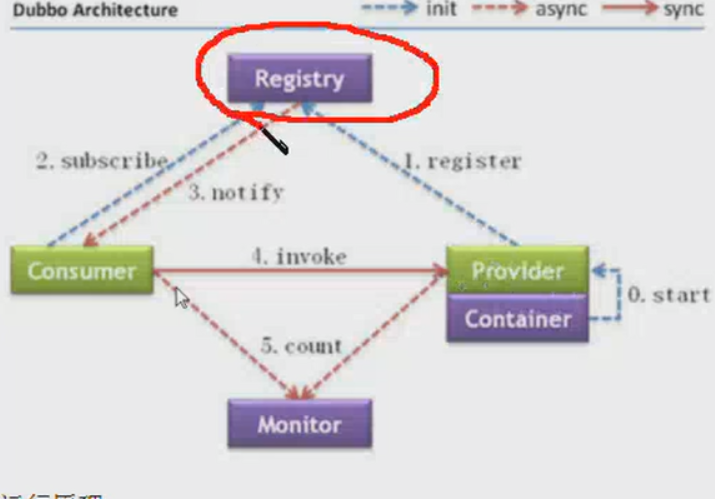

## Dubbo笔记

#### SOA和RPC的理念

**SOA**

+ 面向服务架构
+ 是一个功能模块的单元  提供一系列的服务 被外部调用
+ 更加的好维护 好扩展 节省代码的重复性 

### Dubbo 简介

+ **流程图各模块介绍**
  + provider 提供者 服务发布方
  + Consumer  消费者 服务调用方
  + Container  Dubbo 容器 依赖于Spring容器
  + Register   注册中心  当Container启动的时候把所有可以提供的服务列表上Register进行注册
    + 作用: 告诉Consumer提供了什么服务和服务方在哪里
  + Monitor 监听器 用来统计信息
  + 所有的角色都是可以在单独的服务器上 所以必须遵守特定的协议

+ 是一个高性能的，分布式，透明化的基于java的开源RPC框架。 
+ Dubbo提供了三个关键功能，包括基于接口的远程调用、容错和负载平衡以及自动服务注册和发现。 

+ **运行原理**
  + 启动容器 相当于在启动 Provider
  + 启动后会去Registry中获取服务列表和Provider的地址 进行订阅
  + 当Provider有修改后 注册中心会把消息推送给Consumer
    + 使用观察者设计模式 又叫 发布订阅设计模式
  + 根据获取到的Provider地址 真实调用Provider中的功能
    + 在Consumer中使用了代理设计模式 创建一个Provider类的代理对象通过代理对象获取到Provider中的真实功能 起到保护provider真实功能的作用
  + Consumer每隔一分钟向Mointer发送统计信息 统计信息包含 访问次数 频率等......



+ **Dubbo支持的注册中心**
  + zookeeper
    + 优点:支持集群部署
    + 缺点:稳定性受限于Zookeeper
  + Redis
    + 优点:性能高
    + 缺点:对服务器的要求较高

+ **Dubbo支持的协议**
  + Dubbo 协议
    + 官方推荐的一种协议s
    + 使用NIO(一种新型的IO操作 比较高效)和线程池进行处理
    + 缺点：当传输大文件的时候可能会出现传输文件失败问题 但是可以不用考虑 后期会使用别的传输文件
  + RMI 协议
    + JDK原生的协议  基于TCP
    + 缺点：有时候偶尔会调用失败
    + 优点：jdk原生 不需要导入额外的jar包
  + Hsession 协议
    + 需要导入额外的jar包缺点 并在短链接时性能较低
    + 优点 基于HTTP协议 支持http请求

+ **provider(提供者)的搭建**

  + 新建一个Maven 项目 里面只有接口
    + RPC 框架 不希望consumer知道方法的具体实现  如果实现类和接口在一个项目中那么consumer就会知道方法的具体实现
  + 新建Maven 项目 写接口的实现类 依赖上一个只写接口的jar项目 
  + 如果是2.5.3版本一下的Dubbo需要通过Maven的排除功能去掉老版本的Spring框架 因为在3以前SPring就是在一个jar里面的  后台3之后才进行拆分 发生了很大的改动
  + 首先需要导入对应的dubbojar包 或者添加依赖
  + 还要导入Zookeeper依赖的zkClient jar

  ```xml
  <denpendency>
  	<group> com.101tec </group>
  	<artifactId> zlClient </artifactId>
  	<version>0.10</version>
  </denpendency>
  ```

  + 启动Dubbo容器的两种方式

  + 使用ApplicationContext启动 这个启动的话Spring的容器放置的位置无限制

  + 使用Dubbo提供的Main.main(args)方式启动 需要将Spring放置到类路径下的META-INF/spring/*.xml

  + **配置**

  + ```xml
    <!-- 配置一个provider的名称方便区分 在monitor或者管理工具中 -->
    <dubbo:application name="dubbo-servuce"/>
    
    <!-- 执行注册中的ip和端口号 以及使用哪种注册中心 -->
    <dubbo:registry address="192.168.1900.133:2181" protocol="zookeeper"/>
    
    <!-- 指定使用的RPC协议 以及端口号 在本机就是占用的本机端口号  在服务器就是占用的服务器端口号 -->
    <dubbo:protocol name="dubbo" port="20880"/>
    
    <!-- 注册接口服务 -->
    <dubbo:service interface="top.liwenxiang.service.dubboInterfaceService" ref="service"/>
    
    <!-- 注册接口的实现 -->
    <bean class="top.liwenxiang.serviceImpl" id="service"/>
    ```

  + 约束

  + ```xml
    <beans xmlns="http://www.springframework.org/schema/beans"
           xmlns:xsi="http://www.w3.org/2001/XMLSchema-instance"
           xmlns:context="http://www.springframework.org/schema/context"
           xmlns:dubbo="http://code.alibabatech.com/schema/dubbo"
           xsi:schemaLocation="http://www.springframework.org/schema/beans http://www.springframework.org/schema/beans/spring-beans.xsd
          http://www.springframework.org/schema/context http://www.springframework.org/schema/context/spring-context-3.2.xsd
          http://code.alibabatech.com/schema/dubbo http://code.alibabatech.com/schema/dubbo/dubbo.xsd">
    ```

### Maven 生产者消费者  依赖 - 父模块

```xml
<properties>
    <project.build.sourceEncoding>UTF-8</project.build.sourceEncoding>
    <dubbo.version>2.5.8</dubbo.version>
    <zookeeper.version>3.4.6</zookeeper.version>
    <zkclient.version>0.1</zkclient.version>
</properties>

<dependencyManagement>
    <dependencies>
        <dependency>
            <groupId>com.alibaba</groupId>
            <artifactId>dubbo</artifactId>
            <version>${dubbo.version}</version>
        </dependency>

        <dependency>
            <groupId>org.apache.zookeeper</groupId>
            <artifactId>zookeeper</artifactId>
            <version>${zookeeper.version}</version>
            <type>pom</type>
        </dependency>

        <dependency>
            <groupId>com.github.sgroschupf</groupId>
            <artifactId>zkclient</artifactId>
            <version>${zkclient.version}</version>
        </dependency>

    </dependencies>
</dependencyManagement>
```

**provider 服务提供者依赖**

```xml
<parent>
    <artifactId>dubbo-parent</artifactId>
    <groupId>top.liwenxiang</groupId>
    <version>1.0-SNAPSHOT</version>
</parent>
<modelVersion>4.0.0</modelVersion>

<artifactId>dubbo-api</artifactId>
<dependencies>
    <dependency>
        <groupId>com.alibaba</groupId>
        <artifactId>dubbo</artifactId>
    </dependency>
    <dependency>
        <groupId>org.apache.zookeeper</groupId>
        <artifactId>zookeeper</artifactId>
        <type>pom</type>
    </dependency>
    <dependency>
        <groupId>com.github.sgroschupf</groupId>
        <artifactId>zkclient</artifactId>
    </dependency>
</dependencies>
```

**服务的具体实现模块依赖**

```xml
<parent>
    <artifactId>dubbo-parent</artifactId>
    <groupId>top.liwenxiang</groupId>
    <version>1.0-SNAPSHOT</version>
</parent>
<modelVersion>4.0.0</modelVersion>

<artifactId>provider</artifactId>

<dependencies>
    <!-- 这个是服务接口 因为实现模块需要实现接口进行具体的业务编写 -->    
    <dependency>
        <groupId>top.liwenxiang</groupId>
        <artifactId>dubbo-api</artifactId>
        <version>1.0-SNAPSHOT</version>
    </dependency>
</dependencies>
```

**消费者依赖**

+ dubbo

+ zkClient

+ 服务接口

  **如果是web项目有的话需要将provider服务接口进行安装到本地 mvn insatll 在进行jar的引入进行依赖**

## Assembly 打包插件

+ 第一步 在工程中的pom.xml配置文件中加入如下配置

  ```xml
  <build>
      <plugins>
          <plugin>
              <artifactId>maven-assembly-plugin</artifactId>
              <configuration>
                  <!-- 指定打包描述文件的位置 相对于项目的根目录 -->
                  <!-- 打包的描述文件 -->
                  <descriptor>assembly/assembly.xml</descriptor>
              </configuration>
              <executions>
                  <execution>
                      <id>make-assembly</id>
                      <phase>package</phase>
                      <goals>
                          <goal>single</goal>
                      </goals>
                  </execution>
              </executions>
          </plugin>
      </plugins>
  </build>
  ```

+ ```xml
  assembly.xml 内容
  <?xml version="1.0" encoding="utf-8" ?>
  <assembly xmlns="http://maven.apache.org/plugins/maven-assembly-plugin/assembly/1.1.0"
            xmlns:xsi="http://www.w3.org/2001/XMLSchema-instance"
            xmlns:shcemaLocation="http://maven.apache.org/plugins/maven-assembly-plugin/assembly/1.1.0">
            <!-- 改字符串会添加到tar.gz的名称垢面 作为后缀 -->
            <id>assembly</id>
            <!-- 指定打包的格式tar.gz 该类型压缩包在linux中比较常见 -->
            <formats>
                <format>tar.gz</format>
            </formats>
            <!-- 在tar.gz压缩包中是否包含根文件夹 改根文件夹名称和tar.gz去掉id后缀一致 -->
            <includeBaseDirectory>true</includeBaseDirectory>
            <fileSets>
                <fileSet>
                     <!-- 相对项目根路径的相对路径 -->
                    <directory>assembly/bin</directory>
                    <outputDirectory>bin</outputDirectory>
                    <!-- 设置文件夹权限 和linux中一致 -->
                    <fileMode>0755</fileMode>
                </fileSet>
                <fileSet>
                    <directory>assembly/conf</directory>
                    <outputDirectory>conf</outputDirectory>
                    <fileMode>0644</fileMode>
                </fileSet>
            </fileSets>
            <!-- 将所有依赖的jar包打包到压缩包中的根目录下的lib文件夹 -->
            <!-- 包含第三方jar 以及自己依赖的jar以及服务接口(对于dubbo来说) -->
            <dependencySets>
                <dependencySet>
                    <outputDirectory>lib</outputDirectory>
                </dependencySet>
            </dependencySets>
  </assembly>
  ```

## Linux 安装 mysql

1.yum安装mysql服务

\#yum install mysql mysql-server -y

2.创建跟随系统启动

\#chkconfig mysqld on

3.开启mysql

\#service mysqld start

4.修改mysql root密码

\#mysqladmin -u root password xxxxxx

(xxxxxx改为你要修改的密码。)

5.完成这些，请登陆mysql，删除几个初始帐号

\#mysql -u root -p

输入密码

6.查询出用户

select host,user,password from mysql.user;

7.删除几个匿名和host非本地的帐号

delete from mysql.user where user="" or host!="localhost";

最后将只剩下一个帐号

ps:sql语句每句结束处一定要带;号。

![img](file:///C:\Users\Shinelon\Documents\Tencent Files\2857734156\Image\C2C\7B0CE748050454908BF5120BA25AEACA.png

远程链接  登陆到mysql执行如下命令

GRANT ALL PRIVILEGES ON *.* TO 'root'@'%' IDENTIFIED BY '123456' WITH GRANT OPTION

 flush privileges;  刷新命令 生效

查询   show databases; 

 use mysql   

select host,user from user;

出现设置的内容即可

##构建过程

+ jdk版本需要需要一致  编译的字节码会不一样
+ .bat  .sh 在dubbo的包中可以找到
+ 然后运行 部署 因为生产者 消费者  注册的都哦是同一个注册中心 所以放在哪里无所谓 只要保证注册中心能够连通即可