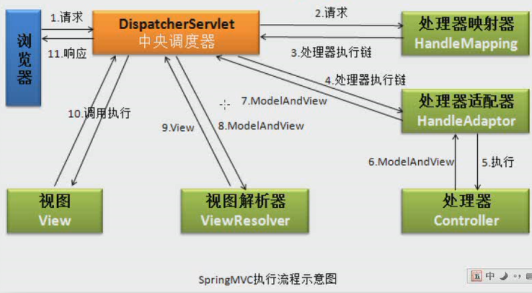
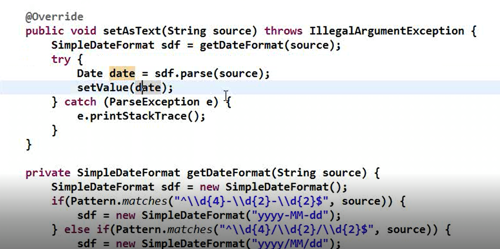
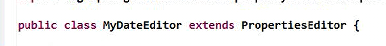

## SpringMVC笔记

### WEB INF 下的资源访问权限

+ 在浏览器上不能够直接访问
+ 但是可以通过在后台的代码跳转过去
+ 是比较安全的资源

### 第一个程序步骤

1. 创建一个Web项目

2. 创建一个类实现Controller接口

   ```java
   public class myController implements Controller {
       @Override
       public ModelAndView handleRequest(HttpServletRequest httpServletRequest,     HttpServletResponse httpServletResponse) throws Exception {
           ModelAndView mv = new ModelAndView();
           //设置值  底层执行的就是 request.setAttribute()
           mv.addObject("message","welcome SpringMvc !");
           // 添加页面
           mv.setViewName("/WEB-INF/jsp/welcome.jsp");
           return mv;
       }
   }
   ```

   

3. 重写方法 并调用方法handleRequest

   1. addObject(key,value)
   2. setVieName("/WEB-INF/jsp/welcome.jsp")

4. 创建配置文件

   1. 注册中央调度器

      ```XML
      <servlet>
          <servlet-name>recopy</servlet-name>
          <servlet-class>org.springframework.web.servlet.DispatcherServlet</servlet-class>
          设置配置文件位置
          <init-param>
              <param-name>contextConfigLocation</param-name>
              <param-value>classpath:spring.xml</param-value>
          </init-param>
          设置在加载服务器时创建DispatcherServlet
          <load-on-startup>1</load-on-startup>
      </servlet>
      设置路径
      <servlet-mapping>
          <servlet-name>recopy</servlet-name>
          <url-pattern>*.do</url-pattern>
      </servlet-mapping>
      ```

5. 在Spring.xml中配置处理器 就是最开始创建的那个类 id 是路径 class 就是那个类

```xml
注册处理器
<bean id="/my.do" class="controll.myController"/>
```

### SpringMvc执行流程图



### SpringMvc UrlPattern

+ 中央调度器 绝对不能配  /*  因为这样会找不到任何资源  /* 是会把动态资源交给DispatcherServlet处理
+ 中央调度器 最好不要配置 /  配置/的话是给静态资源交给DispatcherServlet
+ 如果页面中请求了图片等静态资源 那么就不要配置 / 因为会被拦截

### 设置 支持访问的静态资源

> 是Servlet内部的默认配置 在Servlet容器的Web.xml中

```xml
<!-- 第一种配置方式 -->
<servlet-mapping>
   <servlet-name> default </servlet-name>
   <url-pattern> *.jpg </url-pattern> 
</servlet-mapping>

<servlet-mapping>
   <servlet-name> default </servlet-name>
   <url-pattern> *.png </url-pattern> 
</servlet-mapping>

<servlet-mapping>
   <servlet-name> default </servlet-name>
   <url-pattern> *.js </url-pattern> 
</servlet-mapping>

<servlet-mapping>
   <servlet-name> default </servlet-name>
   <url-pattern> *.css </url-pattern> 
</servlet-mapping>
```

```xml
<!-- 第二种配置方式 -->
<!-- 其在将请求交给DispatcherServlet之后调用Handlemapping然后映射到默认的Servlet请求处理器DefaultServletHttpRequestHandler 对象 而该处理器调用了Tomcat的DefaultServlet来处理静态资源的访问请求 -->
<!-- 需要引入约束 -->
http://www.springframework.org/schema/mvc
http://www.springframework.org/schema/mvc/spring-mvc.xsd

<mvc:default-servlet-handler/>
```

```xml
<!-- 第三种配置方式 -->
<!-- location 表示静态资源所在目录 -->
<!-- mapping 表示对该资源的请求 后面是两个* -->
<!-- 改配置会把改静态资源的请求经HandlerMapping 直接映射到静态资源处理器对象 ResourceHttpRequestHandler	 -->
<mvc:resource location="/images/" mapping="/images/**"></mvc:resource>
```

### SpringMvc 约束

```xml
<?xml version="1.0" encoding="UTF-8" ?>
<beans xmlns="http://www.springframework.org/schema/beans"
       xmlns:xsi="http://www.w3.org/2001/XMLSchema-instance"
       xmlns:context="http://www.springframework.org/schema/context"
       xmlns:aop="http://www.springframework.org/schema/aop"
       xmlns:tx="http://www.springframework.org/schema/tx" xmlns:mvc="http://www.springframework.org/schema/mvc"
       xsi:schemaLocation="http://www.springframework.org/schema/beans
        http://www.springframework.org/schema/beans/spring-beans.xsd
        http://www.springframework.org/schema/context
        http://www.springframework.org/schema/context/spring-context.xsd
        http://www.springframework.org/schema/aop
        http://www.springframework.org/schema/mvc
        http://www.springframework.org/schema/mvc/spring-mvc.xsd
        http://www.springframework.org/schema/aop/spring-aop.xsd
        http://www.springframework.org/schema/tx
        http://www.springframework.org/schema/tx/spring-tx.xsd">
     
</beans>
```

### URLPATTERN 理解

**前台路径**

+ 带 / 表示从当前web服务器路径开始 例如  http://localhost:8080
+ 不带 / 表示从当前访问路径开始算

**后台路径(java代码里)**

+ 带 / 表示从当前项目路径开始 例如   http://localhost:8080/project web项目就是例如WebRoot web 等等文件夹之类

### 配置式开发

#### 处理器映射器

+ 默认的是  BeanNameUrlHandlerMapping  无需注册

+ ```xml
  <bean id="/Hello.html" class="controll.HelloController"/>
  ```

+ 问题

  + 当我们需要这个处理器处理多个请求的时候 就需要注册多个处理器 初始化多个对象

+ 解决

  + 如果同一个处理器无需处理多个请求那么久无需这么创建使用默认的即可

  + 使用 SimpleUrlHandlerMapping  可以解决以上问题

  + ```xml
    <bean class="org.springframework.web.servlet.handler.SimpleUrlHandlerMapping">
        <!-- 第一种形式 -->
        <property name="mappings">
            <props>
                <prop key="/hello.html">myController</prop>
                <prop key="/my.html">myController</prop>
            </props>
        </property>
        <!-- 第二种形式 -->
        <property name="urlMap">
            <map>
                <entry key="/hello.html" value="myController"/>
                <entry key="/my.html" value="myController"/>
            </map>
        </property>
    </bean>
    ```

#### 处理器适配器

+ 实现的两个接口

+ HttpRequestHandlerAdapter

+ SimpleControllerHandlerAdapter

+ 处理器可以实现HttpRequestHandler 和实现Controller一样的效果

+ ```java
  public class HelloController2 implements HttpRequestHandler {
  
      @Override
      public void handleRequest(HttpServletRequest httpServletRequest, HttpServletResponse httpServletResponse) throws ServletException, IOException {
          httpServletRequest.setAttribute("message","Spring Mvc ！");
          httpServletRequest.getRequestDispatcher("/WEB-INF/jsp/welcome.jsp").forward(httpServletRequest,httpServletResponse);
      }
  }
  ```

#### 处理器

+ AbstractControllers

  + 继承此抽象类可以限制提交类型

    + ```JAVA
      public class HelloController2 extends AbstractController {
          @Override
          protected ModelAndView handleRequestInternal(HttpServletRequest        httpServletRequest, HttpServletResponse httpServletResponse) throws Exception {
              ModelAndView mv  = new ModelAndView();
              mv.addObject("message","Springmvc");
              mv.setViewName("/WEB-INF/jsp/welcome.jsp");
              return mv;
          }
      }
      ```

    + 

  + 里面有一个supportMethods属性 可以设置指定的提交方式

    + POST,GET

    + ```XML
      <bean id="/post.html" class="controll.HelloController2">
          <property name="supportedMethods" value="POST"/>
      </bean>		
      ```

  + 其他步骤和使用Controller一样

+ MultiActionController

  + 此类具有一个属性MethodNameResolver 方法名解析器 其具有默认值InternalPathMethodNameResolver

  + 该解析器将方法名作为资源名称进行解析 那就意味这我们提交请求时 要将方法名当作资源名出现

    ```java
    public class HelloController2 extends MultiActionController {
        public ModelAndView doFirst(HttpServletRequest httpServletRequest, HttpServletResponse httpServletResponse) throws Exception {
            ModelAndView mv  = new ModelAndView();
            mv.addObject("message","执行doFirst方法");
            mv.setViewName("/WEB-INF/jsp/welcome.jsp");
            return mv;
        }
    
        public ModelAndView doLast(HttpServletRequest httpServletRequest, HttpServletResponse httpServletResponse) throws Exception {
            ModelAndView mv  = new ModelAndView();
            mv.addObject("message","执行doLast方法");
            mv.setViewName("/WEB-INF/jsp/welcome.jsp");
            return mv;
        }
    }
    ```

    ```xml
    <bean class="org.springframework.web.servlet.handler.SimpleUrlHandlerMapping">
        <property name="urlMap">
            <map>
                <!-- 多加一层是为了和其他请求进行区分 *就是方法名-->
                <entry key="/my/*.html" value="Controllers"/>
            </map>
        </property>
    </bean>
    
    <bean id="Controllers" class="controll.HelloController2"/>
    ```

    

#### 视图解析器

+ InternalResourceViewResolve  内部资源视图解析器
  + 可以配置前缀 preffix 后缀 suffix 拼接逻辑视图进行跳转解析视图 

+ BeanNameViewResolver     视图解析器  可以支持跳转到内外资源

  + ```xml
    <bean class="org.springframework.web.servlet.view.BeanNameViewResolver"/>
    ```

  + RedirectView   可以跳转到外部资源 外部资源视图

  + ```xml
    <!-- 可以访问外部资源 资源视图-->
    <bean  id="taobao" class="org.springframework.web.servlet.view.RedirectView">
    	<property name="url" value="http://www.baidu.com"/>
    </bean>
    ```

  + JstlView           可以跳转到内部资源  内部资源视图

  + ```xml
    <!-- 可以访问内部资源  资源视图 -->
    <bean id="welcome" class="org.springframework.web.servlet.view.JstlView">
    	<property name="url" value="/WEB-INF/jsp/welcome.jsp"/>
    </bean>
    ```

+ Controller 处理器类

  + ```java
    // 不需要传递数据可以直接这么写
    public class HelloController3 implements Controller {
    
        @Override
        public ModelAndView handleRequest(HttpServletRequest httpServletRequest, HttpServletResponse httpServletResponse) throws Exception {
            return new ModelAndView("welcome");
        }
    }
    
    ```

+ 注册处理器

  + ```xml
     <bean id="/my.html" class="controll.HelloController3"/>
     ```

+ XmlViewResolver

  + 将视图配置抽离出去

  + ```xml
    myView.xml
    
    <!-- 可以访问外部资源 资源视图-->
    <bean  id="taobao" class="org.springframework.web.servlet.view.RedirectView">
        <property name="url" value="http://www.baidu.com"/>
    </bean>
    
    <!-- 可以访问内部资源  资源视图 -->
    <bean id="welcome" class="org.springframework.web.servlet.view.JstlView">
        <property name="url" value="/WEB-INF/jsp/welcome.jsp"/>
    </bean>
    ```

  + ```xml
    spring.xml
    
    <!-- 引入视图配置文件 -->
    <bean class="org.springframework.web.servlet.view.XmlViewResolver">
        <property name="location" value="classpath:myView.xml"/>
    </bean>
    
    <bean id="/my.html" class="controll.HelloController3"/>
    ```

+ ResourceBundleViewResolver

  + 可以将视图配置到properties文件中

  + 格式

    + taobao.(class)=org.springframework.web.servlet.view.RedirectView
    + taobao.url=http://taobao.com
    + internalResource.(class)=org.springframework.web.servlet.view.JstlView
    + taobao.url=/WEB-INF/jsp/welcome.jsp

  + 引入

    + ```xml
      <!-- .properties 扩展名可以省略 -->
      <bean class="org.springframework.web.servlet.view.ResourceBundleViewResolver">
      	<property name="basename" value="myView"/>
      </bean>
      ```

+ 视图解析器 优先级

  + 默认是哪个视图解析器放在最前面哪个的优先级就高
  + 但是可以通过order来进行排序 数值越小优先级越高
  + 设置多个视图解析器时使用 
  + 使用多个视图解析器的时候一般在最后放置一个默认的Internal解析器

### 注解式开发

+ 注解式开发的使用频率大于配置式开发

+ 注册组件扫描器

  + ```xml
    // 注解驱动
    <mvc:annotation-driven/>
    <context:component-scan base-package="you of PackageAllName"/>
    ```

+ 在处理器上使用

  + 使用@Controller进行标识

  + 在方法中添加上注解@RequestMapping("/my.do")

  + 可以编写多个处理器方法 赋予不同的访问资源名

  + ```java
    @Controller
    @RequestMapping("/xxx/ooo/jjj")   // 命名空间
    public class Controller{
         加上命名空间访问的话就加上命名空间加上每一个方法的名称进行访问 命名空间就是模块名称每一个模块
        
        
         @RequestMapping("/my.html")  这些请求的前面都会加上命名空间
         public ModelAndView handler(){
             ModelAndView ma = new ModelAndView(request.response);
             ma.addObject("message","SpringMvc handler!");
             ma.setViewName("/WEB-INF/jsp/welcome.jsp");
             return ma;
         };
        
           @RequestMapping("/do.html")  这些请求的前面都会加上命名空间
         public ModelAndView doFirst(){
             ModelAndView ma = new ModelAndView(request.response);
             ma.addObject("message","SpringMvc doFirst!");
             ma.setViewName("/WEB-INF/jsp/welcome.jsp");
             return ma;
         };
        
         这些请求的前面都会加上命名空间 如果不加/会自动拼接上去
         @RequestMapping({"/do.html","hello.html"})  
         public ModelAndView doFirst(){
             ModelAndView ma = new ModelAndView(request.response);
             ma.addObject("message","SpringMvc doFirst!");
             ma.setViewName("/WEB-INF/jsp/welcome.jsp");
             return ma;
         };
        
        *号代表hello前面可以与任意字符
         @RequestMapping({"/do.html","/*hello.html"})  
         public ModelAndView doFirst(){
             ModelAndView ma = new ModelAndView(request.response);
             ma.addObject("message","SpringMvc doFirst!");
             ma.setViewName("/WEB-INF/jsp/welcome.jsp");
             return ma;
         };
        
         *号代表hello前面必须要有匹配的绝对路径文本随意 不可以省略
             例如
              /aaa/hello.html
              /bbb/hello.html
         @RequestMapping({"/do.html","/*/hello.html"})  
         public ModelAndView doFirst(request.response){
             ModelAndView ma = new ModelAndView();
             ma.addObject("message","SpringMvc doFirst!");
             ma.setViewName("/WEB-INF/jsp/welcome.jsp");
             return ma;
         };
        
         *号代表hello前面可以有匹配的路径文本随意 可以是多级也可以没有  可以省略
             例如  /aaa/bbb/hello.html
                  /hello.html
                  /aaa/hello.html
         @RequestMapping({"/do.html","/**/hello.html"})  
         public ModelAndView doFirst(request.response){
             ModelAndView ma = new ModelAndView();
             ma.addObject("message","SpringMvc doFirst!");
             ma.setViewName("/WEB-INF/jsp/welcome.jsp");
             return ma;
         };
        
        表示请求必须携带下面定义的参数 !表示不能为age的参数名 score=100 表示这个参数的值必须等于100
         @RequestMapping(value={"/do.html","/**/hello.html"},params={"name","!age","score=100"})  
         public ModelAndView doFirst(request.response){
             ModelAndView ma = new ModelAndView();
             ma.addObject("message","SpringMvc doFirst!");
             ma.setViewName("/WEB-INF/jsp/welcome.jsp");
             return ma;
         };
    }
    ```

#### 接受参数

+ 逐个接受
  + 直接将表单里的name写到处理器的参数列表即可 类型会自动进行转换

```java
@RequestMapping("/register.do")
//注意 参数类型在传递的时候要一致 不然会报400错误  还有就是名称要和传递的name一样
public ModelAndView doRegister(String name,int age){
    System.out.println("name = " + name);
    System.out.println("age = " + age);
    ModelAndView ma = new ModelAndView();
    ma.addObject("name",name).addObject("age",age);
    ma.setViewName("/WEB-INF/jsp/welcome.jsp");
    return ma;
};
```

+ 设置字符集

  + 使用过滤器 SpringMvc为我们提供好了过滤器 我们只需要在web.xml中配置即可

    + 使用characterEncodingFilter类

  + ```xml
    <filter>
      <filter-name>CharacterEncodingFilter</filter-name>
      <filter-class>org.springframework.web.filter.CharacterEncodingFilter</filter-class>
      <!-- 指定响应编码 -->
      <init-param>
        <param-name>encoding</param-name>
        <param-value>utf-8</param-value>
      </init-param>
      <!-- 强制编码 默认false  使用我们设置的 请求和响应 -->
      <init-param>
        <param-name>forceEncoding</param-name>
        <param-value>true</param-value>
      </init-param> 
    </filter>
    ```

+ 校正请求参数名

  + 使用 @RequestParam("name名") String name

  + ```java
    意思就是使用name来接受name为rname的值
    public ModelAndView doRegister(@RequestParam("rname") String name, int age){}
    ```

+ 以对象形式整体接收

  + 条件: 表单的name需要和实体类的属性名称一致 那么实体的属性就要可数据库的字段名一致
  + 就是将原本的单个接受的换成了一个实体类 就是里面的参数

```java
@RequestMapping("/login.do")
public ModelAndView doLogin(Student student){
    System.out.println("name = " + student.getName());
    System.out.println("name = " + student.getAge());
    ModelAndView ma = new ModelAndView();
    ma.addObject("student",student);
    ma.setViewName("/WEB-INF/jsp/welcome.jsp");
    return ma;
};
```

+ 域属性的参数接收

  + 表单里的name等于实体类名.属性名

  + 例如 

    + ```html
      <form action="test/login.do" method="post">
          <input type="text" name="name"/>
          <input type="text" name="age"/>
          这里是域属性的名字和属性名称
          <input type="text" name="school.sName"/>
          <input type="text" name="school.sAddress"/>
          <br/>
          <input type="submit" value="注册"/>
      </form>
      ```

      

+ 路径参数

  + ```java
    @RequestMapping(value = "/list/{id}",method = RequestMethod.POST)
    @ResponseBody
    public Object list(@PathVariable("id") Integer id){
        List list = new ArrayList<>();
        System.out.println(id);
        list.add("a");
        list.add("a");
        list.add("a");
        return list;
    }
    ```

#### 返回值

+ ModelAndView

  + 在需要跳转页面并且需要传递数据的时候使用这个返回值

+ String

  + 可以直接返回内部资源视图名
  + return "/WEB-INF/jsp/welcome.jsp" || return "welcome" 这样就需要使用内部资源视图解析器
  + 可以直接返回视图对象名
  + 使用BeanNameViewResolver视图解析器 注册了这个视图解析器就可以注册外部资源(resirectView) 和 内部资源(jstlView) 路径了 里面的属性url指向一个路径   注意 **这样的话就不能使用InternalResourceViewReslover视图解析器了**

+ void

  + 可以用来响应ajax返回数据 
  + 可以使用ServletAPI进行跳转 转发 和 重定向

+ Object

  + 步骤  
    + 添加约束
    + 添加 jackson.jar包 Springmvc3.x 使用 2.0  4.x 使用 2.5
    + 注册mvc注解驱动
    + 在方法上添加@ResponseBody
    + 设置编码支持中文 produces = "text/html;charset=utf-8"

  + ```xml
    约束
    <beans xmlns="http://www.springframework.org/schema/beans"
            xmlns:xsi="http://www.w3.org/2001/XMLSchema-instance"
            xmlns:context="http://www.springframework.org/schema/context"
            xmlns:mvc="http://www.springframework.org/schema/mvc"
            xsi:schemaLocation="http://www.springframework.org/schema/beans
            http://www.springframework.org/schema/beans/spring-beans.xsd
            http://www.springframework.org/schema/context http://www.springframework.org/schema/context/spring-context.xsd
            http://www.springframework.org/schema/mvc http://www.springframework.org/schema/mvc/spring-mvc.xsd">
    ```

  + ```xml
    <!-- Mvc 注解驱动 返回Object需要注册这个驱动 -->
    <mvc:annotation-driven/>
    ```

  + 返回值的话需要在方法中添加@ResponseBody 表示将相应内容添加到响应体

  + 但是需要jackson这个jar将数据转为json SpringMvc3.x 用 2.0.0 版本 4.x用2.5.0版本

  + ```
    <!--Jackson required包-->
    <dependency>
      <groupId>com.fasterxml.jackson.core</groupId>
      <artifactId>jackson-core</artifactId>
      <version>2.0.0</version>
    </dependency>
    <dependency>
      <groupId>com.fasterxml.jackson.core</groupId>
      <artifactId>jackson-databind</artifactId>
      <version>2.0.0</version>
    </dependency>
    <dependency>
      <groupId>com.fasterxml.jackson.core</groupId>
      <artifactId>jackson-annotations</artifactId>
      <version>2.0.0</version>
    </dependency>
    ```

  + 返回数值  直接返回即可  return 100.231

  + 返回字符串

    + 需要在requestMapping中配置produces="text/html;charset=utf-8"以支持中文

  + 返回自定义对象 

    + return new Student("张三",123) 直接是json了

  + 返回map

    + return new HashMap().put("stu1",new Student("sd",123)	)

  + 返回List

    + return new  ArrayList<>().add("asd")

#### 区分GET POST  请求

+ ```java
  @RequestMapping(value="/login",method={RequestMethod.POST,RequestMethod.GET})//分模块的请求名字
  只写一个就是支持某一种请求
  ```

#### 请求和重定向

+ 重定向 
  + 是两次请求 用户请求发送到服务端 后来 返回到客户端 再次用户发送请求到服务端 在相应到客户端 所以是不能直接访问WEB-INF文件夹下的文件的 因为是用户发出的请求

+ 转发
  + 是一次请求是在服务端内完成的请求转发 因此可以访问到WEB-INF文件夹下的资源  

+ 重定向 控制器

  + ```java
    @RequestMapping(value = "/redirect")
    public ModelAndView doLast(String name, int age){
        ModelAndView ma  = new ModelAndView();
        ma.addObject("pname",name);
        ma.addObject("page",age);
        // 重定向的时候这里是后台路径 不加/就表示的访问到当前访问的路径加上 welcome
        //加上/就代表的是当前web项目的根加上welcome
        //如果有命名空间还是需要加上的保险
        ma.setViewName("redirect:welcome");
        return ma;
    };
    
    @RequestMapping("/welcome")
    public ModelAndView doWelcome(String pname,int page){
        ModelAndView ma  =  new ModelAndView();
        ma.addObject("name",pname).addObject("age",page);
        ma.setViewName("/welcome.jsp");
        return ma;
    }
    ```

+ 当返回数据的时候返回的是String的话 我们可以在参数内加上一个Model通过model.addAttribute()来设置值

#### 异常处理

+ SimpleMappingExceptionResolver

  + 使用这个异常处理器可以在程序发生异常的时候跳转到错误页面

  + 配置属性  defaulterrorview    value= 页面路径

    + 配置属性   

    + ```java
      @RequestMapping(value = "/throw",produces = "text/html;charset=utf-8")
      public String send(){
          System.out.println(3/0); // 发生错误 就会进入到错误页面
         return "/welcome.jsp";
      };
      ```

    + ```xml
      <!-- 没有id   异常处理器 直接跳转到错误页面 -->
      <bean class="org.springframework.web.servlet.handler.SimpleMappingExceptionResolver">
             <property name="defaultErrorView" value="/welcome.jsp"/>
             <property name="exceptionAttribute" value="ex"/>
      </bean>
      ```

    +  ```jsp
       ${ex.message}  // 在页面中这样显示数据
       ```

      **加入exceptionMappings可以设置指定的错误跳转到指定的错误页面 key里面填写的是全限定类名**

    + ```xml
      <!-- 没有id -->
      <bean class="org.springframework.web.servlet.handler.SimpleMappingExceptionResolver">
          <property name="defaultErrorView" value="/welcome.jsp"/>
          <property name="exceptionAttribute" value="ex"/>
          <property name="exceptionMappings">
              <props>
                  <prop key="Exception.UserException">/errors/userError.jsp</prop>
                  <prop key="Exception.NameException">/errors/nameError.jsp</prop>
              </props>
          </property>
      </bean>
      ```

+ 注解处理异常

  + 这样的话所有的错误都会转发到这个错误也页面

  + ```java
    @ExceptionHandler
    public String test01(Exception ex){
         return "/error.jsp";
    }
    ```

  + 指定异常错误页面跳转

  + ```java
    /* 指定错误页面进行跳转  传入异常的class对象即可*/
    @ExceptionHandler(ArithmeticException.class)
    public String test02(){
      return "/arerror.jsp";
    }
    ```

  + 我们一般使用的时候会将专门的异常处理进行一个类抽离出去 然后在继承这个类 因为异常处理不可能是一个类使用的吧

#### 类型转换器

+ 在SpringMvc中我们接受int类型参数能够成功是因为在内部有类型转换器 但是Date类型的只支持一种格式

  + 例如 2019/02/25 支持
  + 例如 2019-02-25  不支持

+ 我们需要自己定义类型转换器

  + 通过实现 Converter 接口  传入源数据类型和宿数据类型 重写方法进行操作

  + ```java
    public class myCoventer implements Converter<String, Date> {
        @Override
        public Date convert(String s) {
            SimpleDateFormat sdf = new SimpleDateFormat("yyyy-MM-dd");
            try {
                return sdf.parse(s);
            } catch (ParseException e) {
                e.printStackTrace();
            }
            return null;
        }
    }
    ```

  + 定义完毕之后需要注册类型转换器  

  + ```xml
    <!-- 注册类型转换器 -->
    <bean id="converter" class="Controller.myCoventer"/>
    
    <!-- 注册类型转换服务工厂 -->
     <bean id="conversionService" class="org.springframework.context.support.ConversionServiceFactoryBean">
            <property name="converters">
                   <set>
                         <ref bean="converter"/>
                   </set>
            </property>
     </bean>
    
    <!-- 注册注解驱动 -->
    <mvc:annotation-driven conversion-service="conversionService"/>
    ```

+ 处理多种日期类型

  + 在我们定义了一个日期类型之后 我们规定的格式是可以了 但是以前的格式却不可以了 这是不行的

  + 所以我们需要新建一个方法进行判断 让他支持多种日期格式

  + ```java
    package Controller;
    import org.springframework.core.convert.converter.Converter;
    import java.text.ParseException;
    import java.text.SimpleDateFormat;
    import java.util.Date;
    import java.util.regex.Pattern;
    public class myCoventer implements Converter<String, Date> {
        @Override
        public Date convert(String s) {
            SimpleDateFormat sdf = getDataFormat(s);
            try {
                return sdf.parse(s);
            } catch (ParseException e) {
                e.printStackTrace();
            }
            return null;
        }
        private SimpleDateFormat getDataFormat(String s) {
            if (Pattern.matches("^\\d{4}-(\\d{2})-\\d{2}$",s)){
                return  new SimpleDateFormat("yyyy-MM-dd");
            }else if (Pattern.matches("^\\d{4}/\\d{2}/\\d{2}$",s)){
                return  new SimpleDateFormat("yyyy/MM/dd");
            }else if (Pattern.matches("^\\d{4}\\d{2}\\d{2}$",s)){
                return  new SimpleDateFormat("yyyyMMdd");
            }else{
                // 为了验证数据 在数据填写错误的时候抛出这个异常 异常解析器监听到就会进行处理
                throw new TypemismatchException(s,Date.class)
            }
            return null;
        }
        
    } 
    // 控制器里
    // 异常处理器
    // 这个异常就是数字转换出错异常以前的NumberFormatException
    @ExceptionHandler(TypeMismatchException.class)
        public ModelAndView exception(){
            return new ModelAndView("/index.jsp");
        }
    // 里面可以传入多个参数  在发生异常的时候依然可以拿到请求的参数 通过request
    @ExceptionHandler(ArithmeticException.class)
        public String test02(Exception ex, HttpServletRequest request, HttpServletResponse response, HttpSession session){
            return "/arerror.jsp";
        }
        
        // 初始化参数 一种日期类型   不需要在注册类型转换器 转换服务工厂  mvc注解服务等.......
        @InitBinder
        public void initBinder(WebDataBinder binder){
             SimpleDateFormat sf = new SimpleDateFormat("yyyy-MM-dd");
             binder.registerCustomEditor(Date.class,new CustomDateEditor(sf,true));
        }
        
     
    ```


​    初始化多个参数的话  	

#### 验证器

+ 需要 hibernate-validate jar 包

+ 需要注册

+ ```xml
  <bean id="LocalValidator" class="org.springframework.validation.beanvalidation.LocalValidatorFactoryBean">
       <property name="providerClass" value="org.hibernate.validator.HibernateValidator"/>
  </bean>
  <mvc:annotation-driven validator="LocalValidator"/>
  ```

+ 可以直接在实体类中的成员变量上面加上注解进行验证

+ @NotNull(message="不能为空")

+ @Min(value=0,message="不能小于{value}"

+ @Max(value=100,mssage="不能大于{value}")

+ @Size(min=3,max=10,message="只能在{min}---{max}个字符")

+ @Pattern(regexp="^1[34578]\\d{9}$",message="手机格式不正确")

+ maven 依赖

  + ```xml
    <!--jsr 303-->
    <dependency>
      <groupId>javax.validation</groupId>
      <artifactId>validation-api</artifactId>
      <version>1.1.0.Final</version>
    </dependency>
    
    <dependency>
      <groupId>org.hibernate</groupId>
      <artifactId>hibernate-validator</artifactId>
      <version>5.2.0.Final</version>
    </dependency>
    ```

```java
在实体类加上验证之后 在我们的控制器开始使用 传入的是一个实体类 参数
@RequestMapping("/validator")
public ModelAndView test02(@Validated Student student, BindingResult br){
    ModelAndView ma = new ModelAndView();
    ma.addObject("student",student);
    ma.setViewName("/WEB-INF/jsp/welcome.jsp");
    int errorCount = br.getErrorCount();
    if (errorCount > 0){
        FieldError nameError = br.getFieldError("name");
        FieldError scoreError = br.getFieldError("score");
        FieldError phoneError = br.getFieldError("phone");
        if (nameError != null){
            String nameErrorMsg = nameError.getDefaultMessage();
            ma.addObject("nameErrorMsg",nameError);
        }
        if (scoreError != null){
            String scoreErrorMsg = scoreError.getDefaultMessage();
            ma.addObject("scoreErrorMsg",scoreErrorMsg);
        }
        if (phoneError != null){
            String phoneErrorMsg = phoneError.getDefaultMessage();
            ma.addObject("phoneErrorMsg",phoneErrorMsg);
        }
        ma.setViewName("/index.jsp");
    }
    return ma;
};
```
#### 文件上传

+ 需要添加注解驱动  否则会报错  <mvc:annotation-driven/>
+ 注意 客户端表单里的input name 要和控制器里面接受的参数名一致 否则为null

+ ```xml
  <!-- 注册上传解析器 id 必须是multipartResolver 底层通过这个名字获取-->
  <bean id="multipartResolver" class="org.springframework.web.multipart.commons.CommonsMultipartResolver"/>
  <!-- 如果乱码加入如下配置  -->
  <bean id="multipartResolver" class="org.springframework.web.multipart.commons.CommonsMultipartResolver">
    <property name="defaultEncoding" value="utf-8"></property>
    <property name="maxUploadSize" value="1023546"/> 限制大小 会出异常 可以设置异常处理解析器
  </bean>
  ```

+ ```java
  上传到本地磁盘路径
  @Controller
  @RequestMapping("/upload")
  public class uploadController {
      @RequestMapping(value = "/upFile")
      @ResponseBody
      public Object uploadFile(MultipartFile img) throws IOException {
          String name = img.getOriginalFilename(); 获取到上传的名称
          File file = new File("D:/images",name);
          img.transferTo(file);
          return name;
      }
  }
  上传到服务器路径
  @Controller
  @RequestMapping("/upload")
      public class uploadController {
          @RequestMapping(value = "/upFile")
          @ResponseBody
          public Object uploadFile(MultipartFile img, HttpSession session) throws IOException{
          // 服务器路径 可以返回做图片回显  加上 文件名字
          String projectServerPath = request.getScheme() + "://"+request.getServerName()+":" +
                request.getServerPort() + request.getContextPath() + "/upload/";
              // 判断大小的话可以判断名称的结尾
              String name = img.getOriginalFilename();
              // 设置服务器的根路径 上传的绝对路径  idea 默认不会编译空文件夹
              String path = session.getServletContext().getRealPath("/upload");
              File file = new File(path,name);
              img.transferTo(file);  // 执行上传操作
              return path;
          }
  
  }
  //报错的话我们可以通过异常处理解析器解决
  
  上传多个文件
  @Controller
  @RequestMapping("/upload")
      public class uploadController {
          @RequestMapping(value = "/upFile")
          @ResponseBody
          //不加会报错
          //这里加上RequestParam是说Springmvc 不会为我们自动将我们的上传文件封装成一个数组  这里需要矫正参数
          public Object uploadFile(@RequestParam MultipartFile imgs, HttpSession session) throws IOException{
              // 判断大小的话可以判断名称的结尾
              String name = img.getOriginalFilename();
              // 设置服务器的根路径  idea 默认不会编译空文件夹
              String path = session.getServletContext().getRealPath("/upload");
              for(MultipartFile img : imgs){
                  // 判断是否选择了上传图片
                  if(img.getSize() > 0){
                       File file = new File(path,name);
              	 img.transferTo(file);  
                  } 
              }
            
              return path;
          }
  
  }
  ```

#### 拦截器

+ 自定义拦截器

  + 需要实现 HandlerInterceptor 接口

+ 注册拦截器 需要用到 mvc 约束

  + ```xml
    <mvc:interceptors>
        <mvc:interceptor>
            <mvc:mapping path="/**"/>
            <bean class="Interector.OneInterector"/>
        </mvc:interceptor>
    </mvc:interceptors>
    ```

+ 拦截器链

  + 如果有多个拦截器 其中又一个preHandler返回false那么这个拦截器链就断了 后面的就不会执行了
  + 但是afterCompletion这个方法的执行依据是该拦截器里面的preHandler方法返回值是true并且是已经执行了的
  + 还有就是多个拦截器的执行流程是先从1连接器执行pre到2拦截器pre在返回着执行2的post然后是1的post最后是2的after1的after

+ 简单权限拦截器实例

  + 请求路径拦截的为 /**

  + ```java
    @Override
    public boolean preHandle(HttpServletRequest httpServletRequest, HttpServletResponse httpServletResponse, Object o) throws Exception {
        /**
         * 在请求之前执行 返回true才会继续执行  返回false不会执行之后 但是此方法会执行
         **/
        System.out.println("执行OneInterector proHandler方法");
        String user = (String)httpServletRequest.getSession().getAttribute("user");
        if (!("liwenxiang".equals(user))){
            httpServletRequest.getRequestDispatcher("/fail.jsp").forward(httpServletRequest,httpServletResponse);
            return false;
        }
        return true;
    }
    ```

  + ```java
    @RequestMapping(value = "/userInfo")
    public ModelAndView doSome(HttpSession session){
       ModelAndView ma  = new ModelAndView();
       ma.addObject("name",session.getAttribute("user"));
       ma.setViewName("/WEB-INF/jsp/welcome.jsp");
       return ma;
    }; 
    ```

#### SSM 合并

+ 其实SpringMvc也属于Spring的一部分 因此没必要做什么整合
+ 真正的整合就是Spring和Mybatis的整合
+ 在后来我们将每一个配置都分离出来 通过 Spring-*xml引入
+ 我们将dao注入到Service将Service注入到Controller
+ 在Webxml配置监听器监听Spring容器的创建 

