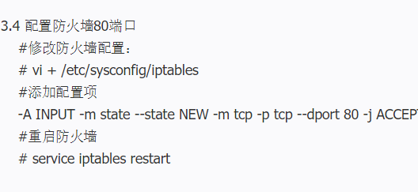

### Nginx 笔记

#### 搭建Nginx环境



+ Nothing to do  表示已经安装过了
+ cd nginx-1.6.2 && ./configure --prefix=/usr/local/nginx 这个是生成的目录 不是我们解压的目录

### 反向代理

+ 在location中配置 proxy_pass  代理服务器

### 负载均衡

+ 和 httpserver同级
+ 配置 upstream mystream {      server 服务器IP ;       }


```nginx
server {
        listen       80;
        server_name  192.168.190.137:80;
	   
		#charset koi8-r;

   		 #access_log  logs/host.access.log  main;
        /* 静态资源 */
        location ^~ /static/ {
                root html;
        }

    	/* 首页 */
        location / {
            root   html;
            index  index.html index.htm;
        }
    
    

		 location / {
             proxy_pass http://192.168.43.19:8080;
         }


    	/* 反向代理到另一个服务器 */
        location ~* .*(\.php|\.png)$ {
             proxy_pass http://192.168.43.19:8080;
        }

        #error_page  404              /404.html;

        # redirect server error pages to the static page /50x.html
        #
        error_page   500 502 503 504  /50x.html;
        location = /50x.html {
            root   html;
        }
}
语法规则： location [=|~|~*|^~] /uri/ { … }
= 开头表示精确匹配
^~ 开头表示uri以某个常规字符串开头，理解为匹配 url路径即可。nginx不对url做编码，因此请求为/static/20%/aa，可以被规则^~ /static/ /aa匹配到（注意是空格）。
~ 开头表示区分大小写的正则匹配
~*  开头表示不区分大小写的正则匹配
!~和!~*分别为区分大小写不匹配及不区分大小写不匹配 的正则
/ 通用匹配，任何请求都会匹配到。
多个location配置的情况下匹配顺序为（参考资料而来，还未实际验证，试试就知道了，不必拘泥，仅供参考）：
首先匹配 =，其次匹配^~, 其次是按文件中顺序的正则匹配，最后是交给 / 通用匹配。当有匹配成功时候，停止匹配，按当前匹配规则处理请求。
```