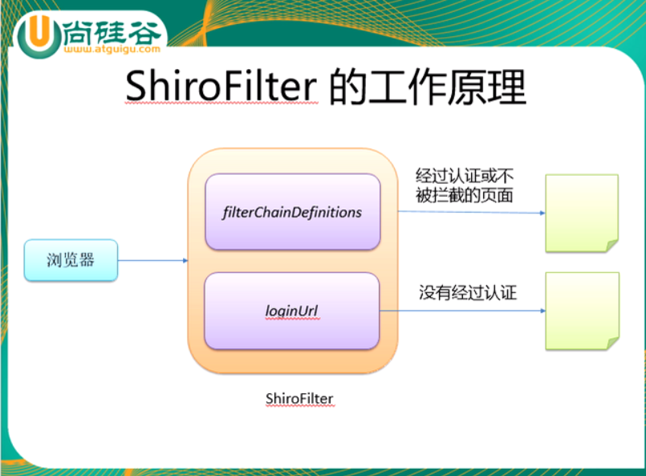
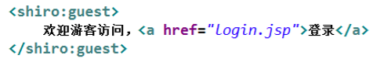
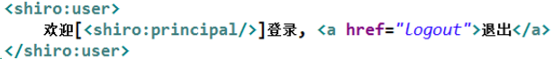
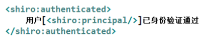
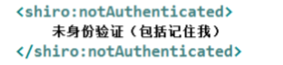
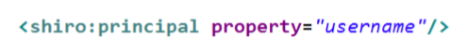
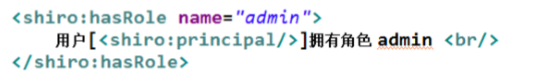
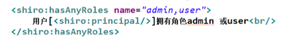
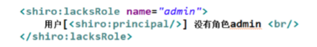
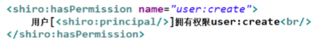

## Shiro Java 安全框架

+ 是Apache的产品
+ 是java安全框架
+ 支持javase和javaee环境
+ 比较主流 好用

###模块划分

+ Subject  任何可以与应用交互的用户
+ SecurityManager 相当于SpringMVC中的DispatcherServlet 是Shiro的心脏 所有具体的交互都由SecurityManager 进行控制 它管理这所有Subject 且负责进行认证 授权 会话以及缓存的管理
+ Authenticator 负责Subject认证 是一个扩展点 可以自定义实现可以使用认证策略 即什么情况下认证通过了
+ Authorizer   授权器 即访问控制器 
+ Realm  安全实体数据源
+ SessionManager 管理Session生命周期的组件
+ CacheManager 缓存控制器
+ Cryptography 密码模块

###首先配置 web.xml 的配置Filter

```xml
web.xml 配置

<filter>
    <filter-name>shiroFilter</filter-name>
    <filter-class>org.springframework.web.filter.DelegatingFilterProxy</filter-class>
    <init-param>
    <param-name>targetFilterLifecycle</param-name>
    <param-value>true</param-value>
    </init-param>
</filter>

<filter-mapping>
    <filter-name>shiroFilter</filter-name>
    <url-pattern>/*</url-pattern>
</filter-mapping>
```

```xml
applicationContext.xml  基本配置

<bean class="org.springframework.aop.framework.autoproxy.DefaultAdvisorAutoProxyCreator"
              depends-on="lifecycleBeanPostProcessor"/>
        <bean class="org.apache.shiro.spring.security.interceptor.AuthorizationAttributeSourceAdvisor">
            <property name="securityManager" ref="securityManager"/>
        </bean>

        <!-- 配置緩存管理器 -->
        <bean id="cacheManager" class="org.apache.shiro.cache.ehcache.EhCacheManager">
            <!-- 指定 ehcache 的配置文件，下面会给到 -->
            <property name="cacheManagerConfigFile" value="classpath:ehcache.xml"/>
        </bean>

        <!-- 配置进行授权和认证的 Realm，要新增一个java类来实现，下面会有，class=包名.类名，init-methood是初始化的方法 -->
        <bean id="myRealm"
              class="top.liwenxiang.realm.userRealm">
             <!-- 配置加密 会将我们输入的字符串进行加密 -->
             <property name="credentialsMatcher">
                 <!-- 一个credentialsMatcher的实现类  -->
                 <bean class="org.apache.shiro.authc.credential.HashedCredentialsMatcher">
                        <property name="hashIterations" value="1024"/>
                        <property name="hashAlgorithmName" value="MD5"/>
                 </bean>
             </property>
        </bean>

        <!-- 配置 Shiro 的 SecurityManager Bean. -->
        <bean id="securityManager" class="org.apache.shiro.web.mgt.DefaultWebSecurityManager">
            <property name="cacheManager" ref="cacheManager"/>
            <property name="realm" ref="myRealm"/>
            <property name="rememberMeManager.cookie.maxAge" value="60" />
        </bean>

    <!-- 配置 Bean 后置处理器: 会自动的调用和 Spring 整合后各个组件的生命周期方法. -->
    <bean id="lifecycleBeanPostProcessor"
          class="org.apache.shiro.spring.LifecycleBeanPostProcessor"/>

    <!-- 配置 ShiroFilter bean: 该 bean 的 id 必须和 web.xml 文件中配置的 shiro filter 的 name 一致  -->
    <bean id="shiroFilter" class="org.apache.shiro.spring.web.ShiroFilterFactoryBean">
        <!-- 装配 securityManager -->
        <property name="securityManager" ref="securityManager"/>
        <!-- 配置登陆页面 -->
        <property name="loginUrl" value="/login.jsp"/>
        <!-- 登陆成功后的一面 -->
        <property name="successUrl" value="/index.jsp"/>
        <property name="unauthorizedUrl" value="/unauth.jsp"/>
        <!-- 具体配置需要拦截哪些 URL, 以及访问对应的 URL 时使用 Shiro 的什么 Filter 进行拦截.  -->
        <property name="filterChainDefinitions">
            <value>
                <!-- 配置登出: 使用 logout 过滤器 -->
                /login.jsp = anon
                /index.jsp = anon
                /** = authc
            </value>
        </property>
    </bean>


```

### Shiro工作流程



### ShiroFiter (DelegatingFilterProxy)

+ DelegatingFilterProxy 是 Filter的一个代理 默认情况下Spring会从IOC容器中查找和<filter-name>一致的filter bean 也可以通过targetBeanName来进行配置filter bean 的 id
+ 如果找不到或者不匹配的话就会抛出异常 NoSuchBeanDefinitonException

```xml
web.xml 里
<filter>
    <filter-name>shiroFilter</filter-name>
    <filter-class>org.springframework.web.filter.DelegatingFilterProxy</filter-class>
    <init-param>
        <param-name>targetFilterLifecycle</param-name>
        <param-value>true</param-value>
    </init-param>
    <init-param>
        <param-name>targetBeanName</param-name>
        <param-value>test</param-value>
    </init-param>
</filter>
spring 容器中
<bean id="shiroFilter" class="org.apache.shiro.spring.web.ShiroFilterFactoryBean">
    <property name="securityManager" ref="securityManager"/>
    <property name="loginUrl" value="/login.jsp"/>
    <property name="successUrl" value="/list.jsp"/>
    <property name="unauthorizedUrl" value="/unauthorized.jsp"/>
    <!--
         配置哪些页面需要受保护.
         以及访问这些页面需要的权限.
         1). anon 可以被匿名访问
         2). authc 必须认证(即登录)后才可能访问的页面.
         3). logout 登出.
         4). roles 角色过滤器
        -->
    <property name="filterChainDefinitions">
        <value>
            /login.jsp = anon
            /list.jsp = authc
        </value>
    </property>
</bean>
```

### (权限配置)filterChainDefinitions

+ 采用  路径 = 拦截器 的形式
+ anon 表示匿名可以访问
+ authc 表示必须认证之后才可以访问
+ logout 退出登出  例如  /shiro/logout = logout
+ 可以使用Ant风格配置 ? 表示 0 - 1 个字符  * 表示 1 - n 多个字符  ** 表示多重路径
+ 匹配规则有个优先规则 后面的配置会被前面的覆盖 
+ 所以配置的时候尽量将单一的配置放在前面  涉及范围广的配置放在后面 否则就会被覆盖

### 认证(登录)

1. 先获取 Subject 调用 SecurityUtils.getSubject() 方法
2. 测试当前用户是否已经被认证 即是否已经登录 调用 Subject的isAuthenticated()方法进行验证
3. 若没有被认证 则用户名和密码封装为UsernamePassowrdToken对象
   1. 创建一个表单页面
   2. 把请求提交到SpringMVC的Handler
   3. 获取到用户名和密码
4. 执行登录 调用Subject的login(AuthenticationToken)方法
5. 自定义Realm的方法 从数据库中将记录数读出 返回给Shiro
   1. 需要继承org.apache.shiro.realm.AuthenticatingRealm抽象类
   2. 实现doGetAuthenticationInfo(AuthenticationToken)方法
6. 由shiro完成对密码的比对 完成登录

#### 简单登录流程

shiroLogin Handler

```java
@Controller
@RequestMapping("/shiro")
public class shiroLogin {

    @RequestMapping(value = "/login")
    public String shiroLogin(@RequestParam("username") String username,@RequestParam("password") String password){
        Subject subject = SecurityUtils.getSubject();
        boolean authenticated = subject.isAuthenticated();
        if (!authenticated){
            UsernamePasswordToken token = new UsernamePasswordToken(username,password);
            token.setRememberMe(true);
            try{
                subject.login(token);
            }catch (AuthenticationException ex){
                System.out.println("登陆失败" + ex.getMessage());
                return "login";
            }
        }
        return "list";
    }

}
```

shiroRealm 单个 Realm

```java
public class SiroRealm extends AuthenticatingRealm {

    @Override
    protected AuthenticationInfo doGetAuthenticationInfo(
        AuthenticationToken authenticationToken) throws AuthenticationException {
        /* 进行登录的处理 和去数据库获取数据进行认证 */
        /* 1. 将  AuthenticationToken  强转成 UsernamePasswordToken*/
        UsernamePasswordToken uptoken = (UsernamePasswordToken) authenticationToken;
        /* 2. 获取当用户名 */
        String username = uptoken.getUsername();
        /* 为了方便就不去数据库写东西了 直接写静态的 这里是从数据库中查询对应的信息*/
        System.out.println("从数据库中获取username :" + username + "所对应的用户信息");
        /* 如果用户不存在 那么久抛出UnknowAccountException 异常 */
        if ("unknow".equals(username)){
            throw new UnknownAccountException("用户不存在");
        }
        if ("monster".equals(username)){
            throw new LockedAccountException("用户被锁定");
        }
        /* 根据用户的情况 决定是否需要抛出AuthenticationException异常 */
        // 以下信息是从数据库中获取的
        // 1. principal  可以是用户的实体也可以是用户名
        Object oo = username;
        // 2. credentials 密码   Shiro会自动比对
        Object pass = "123456";
        // 3. realm Name 当前realm的name 调用父类的getName()即可
        String realm = super.getName();
        // 根据用户的情况返回 AuthenticationInfo 通常实现的实现类是 SimpleAuthenticationInfo
        SimpleAuthenticationInfo  info = new SimpleAuthenticationInfo(oo,pass,realm);
        return info;
    }
}
```

### 密码的比对

+ 使用AuthenticatingRealm的CredentialsMatcher属性进行密码的比对

+ 这个接口有多个实现类 都是可以盐值加密

  + md5
  + sha1
  + ...

+ ```java
  可以给我们的值进行加密  可以给传入的值 或者 从数据库取出来的值 都可以进行加密
  Param:  1.  加密的算法   例如  MD5
  Param:  2.  加密的字符串 例如 123456
  Param:  3.  加盐        例如   ？？？？
  Param:  4.  加密次数    int 类型  例如  int   hashIterations = 1024;
  SimpleHash simpleHash = new SimpleHash(hash,pass, salt, hashIterations);
  ```

+ ```java
  给Realm配置加密  就是会给我们输入的密码进行加密
  <bean class="top.liwenxiang.shiro.SiroRealm" id="jdbcRealm">
      <!-- 密码比对器  这里的是将我们输入的密码进行加密-->
      <property name="credentialsMatcher">
          <!-- 实现类 进行加密 -->
            <bean class="org.apache.shiro.authc.credential.HashedCredentialsMatcher">
                    <!-- 设置加密的次数 -->
                  <property name="hashIterations" value="1024"/>
                   <!-- 设置MD5 -->
                  <property name="hashAlgorithmName" value="MD5"/>
            </bean>
      </property>
  </bean>
  
  ```

### 盐值加密

+ 使用SimleAuthenticationInfo最复杂的那个构造器 四个参数

  + 第一个参数是 返回的数据实体 或者username
  + 第二个参数是 从数据库中查询出来的密码
  + 第三个参数是 盐值加密
  + 第四个参数是 realm的名字

+ 盐值加密使用 ByteSource.Util.bytes(String cyprtStr) 返回值是 ByteSource

+ 代码实例

  + ```java
    String usernmae = "user";
    String hashType = "MD5";
    String hashStr = "123456";
    Object salt = ByteSource.Util.bytes(usernmae);
    SimpleHash s = new SimpleHash(hashType,hashStr,salt,1024);
    System.out.println(s);
    
    // realm 中返回的SimpleAuthenticationInfo的实现类
    SimpleAuthenticationInfo  info = new SimpleAuthenticationInfo(username,pass,salt,realmName);
    ```

### 授权

+ 授权的时候要让我们的Realm继承AuthorizingRealm这个抽象类 实现里面的两个方法 分别由 授权的和认证的  

+ 在之前我们进行认证的时候继承的是AuthenticatingRealm

+ ```java
  public class SiroRealm extends AuthorizingRealm {
              // 用于认证的方法
              @Override
              protected AuthenticationInfo doGetAuthenticationInfo(
                  return null;
                  }
  
          // 用于授权的方法
          @Override
          protected AuthorizationInfo doGetAuthorizationInfo(PrincipalCollection principalCollection) {
              return null;
          }
  }
  ```

+ 例子

  + ```java
    // 用于授权的方法
    @Override
    protected AuthorizationInfo doGetAuthorizationInfo(PrincipalCollection principalCollection) {
        System.out.println("进入Roles");
        Set<String> roles = new HashSet<>();
        // Set内添加的就是Role
        roles.add("user");
        Object  principal = principalCollection.getPrimaryPrincipal();
        System.out.println(principal);
        if ("admin".equals(principal)){
            roles.add("admin");
        }
        SimpleAuthorizationInfo as = new SimpleAuthorizationInfo(roles);
        return as;
    }
    ```

### Shiro 标签

+ Shiro 提供了 JSTL 标签用于在 JSP 页面进行权限控制，如 根据登录用户显示相应的页面按钮
+ guest 标签：用户没有身份验证时显示相应信息，即游客 访问信息
+ 
+ user 标签：用户已经经过认证/记住我登录后显示相应的信 息
+ 
+ authenticated 标签：用户已经身份验证通过，即 Subject.login 登录成功，不是记住我登录的
+ 
+ notAuthenticated 标签：用户未进行身份验证，即没有调 用Subject.login进行登录，包括记住我自动登录的也属于 未进行身份验证。
+ 
+ pincipal 标签：显示用户身份信息，默认调用 Subject.getPrincipal() 获取，即 Primary Principal 如果是个是实体 可以获取属性
+ 
+ hasRole 标签：如果当前 Subject 有角色将显示 body 体内容
+ 
+ hasAnyRoles 标签：如果当前Subject有任意一个 角色（或的关系）将显示body体内容
+ 
+ lacksRole：如果当前 Subject 没有角色将显 示 body 体内容
+ 
+ hasPermission：如果当前 Subject 有权限 将显示 body 体内容
+ 

### 缓存

+ Realm 默认使用了缓存  前提是需要配置 
+ 以后可以使用redis做缓存

### Session

+ 可以在Service里用 通过 SecurityUtils.getSubject().getSession() 获取
+ 一般在web项目中还是推荐使用HttpSession
+ session.getId()   获取当前会话的唯一标识 
+  session.getHost()：获取当前Subject的主机地址 
+  session.getTimeout() & session.setTimeout(毫秒)：获取/设置当 前Session的过期时间 
+  session.getStartTimestamp() & session.getLastAccessTime()： 获取会话的启动时间及最后访问时间；如果是 JavaSE 应用需要自己定 期调用 session.touch() 去更新最后访问时间；如果是 Web 应用，每 次进入 ShiroFilter 都会自动调用 session.touch() 来更新最后访问时间。
+  session.setAttribute(key, val) & session.getAttribute(key) & session.removeAttribute(key)：设置/获取/删除会话属 性；在整个会话范围内都可以对这些属性进行操作

### 注册登录DEMO

```java
realm   安全实体数据源
package top.liwenxiang.realm;

import org.apache.shiro.authc.*;
import org.apache.shiro.authz.AuthorizationInfo;
import org.apache.shiro.authz.SimpleAuthorizationInfo;
import org.apache.shiro.realm.AuthorizingRealm;
import org.apache.shiro.subject.PrincipalCollection;
import org.apache.shiro.util.ByteSource;
import org.springframework.beans.factory.annotation.Autowired;
import top.liwenxiang.beans.user;
import top.liwenxiang.service.IUserService;

import java.util.HashSet;
import java.util.Set;

public class userRealm  extends AuthorizingRealm {
    @Autowired
    IUserService service;

    // 授权
    @Override
    protected AuthorizationInfo doGetAuthorizationInfo(PrincipalCollection principalCollection) {
        Object principal = principalCollection.getPrimaryPrincipal();
        System.out.println("授权");
        Set<String> set = new HashSet<>();
        set.add("user");
        if ("admin".equals(principal)){
            set.add("admin");
        }
        SimpleAuthorizationInfo info = new SimpleAuthorizationInfo(set);
        return info;
    }

    // 认证
    @Override
    protected AuthenticationInfo doGetAuthenticationInfo(AuthenticationToken authenticationToken) throws AuthenticationException {
        UsernamePasswordToken token = (UsernamePasswordToken) authenticationToken;
        String username = token.getUsername();
        user userByUserName = service.findUserByUserName(username);
        //这里的加盐是传递过去和密码进行比对的 因为我们可能在注册的时候也加盐了
        ByteSource bs = ByteSource.Util.bytes(username);
        SimpleAuthenticationInfo info = new SimpleAuthenticationInfo(username,userByUserName.getUpwd(),bs,getName());
        return info;
    }


}

```

```java
handler 
package top.liwenxiang.handler;

import org.apache.shiro.SecurityUtils;
import org.apache.shiro.authc.AuthenticationException;
import org.apache.shiro.authc.UsernamePasswordToken;
import org.apache.shiro.crypto.hash.SimpleHash;
import org.apache.shiro.subject.Subject;
import org.apache.shiro.util.ByteSource;
import org.springframework.beans.factory.annotation.Autowired;
import org.springframework.stereotype.Controller;
import org.springframework.web.bind.annotation.*;
import top.liwenxiang.beans.user;
import top.liwenxiang.service.IUserService;

import javax.servlet.http.HttpServletRequest;

@Controller
@RequestMapping("/user")
public class IUserHandler {

    @Autowired
    IUserService service ;

    public void setService(IUserService service) {
        this.service = service;
    }

    @RequestMapping(value = "/login.do",method = RequestMethod.POST)
    public String login(@RequestHeader("Origin")String origin, HttpServletRequest request, @RequestParam("username") String username, @RequestParam("password") String password){
        String me = request.getParameter("isMe");
        /**
         * 首先获取Subject
         */
        Subject subject = SecurityUtils.getSubject();
        boolean authenticated = subject.isAuthenticated();
        if (!authenticated){
            UsernamePasswordToken token = new UsernamePasswordToken(username,password);
            if (me != null){
                System.out.println("记住我");
                token.setRememberMe(true);
            }
            try{
                subject.login(token);
                System.out.println("登陆成功");
            }catch (AuthenticationException ex){
                System.out.println("登陆失败" + ex.getMessage());
                return "redirect:/login.jsp";
            }
        }
        return "redirect:/success.jsp";
    }


    @RequestMapping(value = "/register.do",method = RequestMethod.POST)
    public String register(user u){
        String hashType = "MD5";
        Object hashStr = u.getUpwd();
        ByteSource slaf = ByteSource.Util.bytes(u.getUname());
        int hashNums = 1024;
        SimpleHash hash = new SimpleHash(hashType,hashStr,slaf,hashNums);
        u.setUpwd(hash.toString());
        int i = service.addUser(u);
        if (i != 0){
            return "redirect:/login.jsp?text=success";
        }else{
            return "redirect:/reg.jsp?text=error";
        }
    }

    @ExceptionHandler
    public String fail(){
        return "redirect:fail.jsp";
    };


}

```

