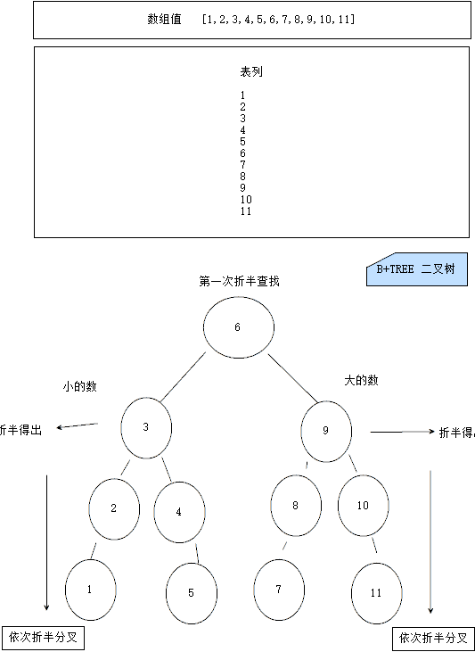

## sql优化

###存储引擎

+ mysqld   mysql  数据库管理系统 结构


#### 存储引擎(是建立在表上的)

+ ISAM

  + 进行读取的时候速度是比较快的 但是有两个致命的不足就是不支持事务 也不能容错
  + 加入你的数据库崩溃了你的数据就不能恢复了 所以说如果在使用ISAM存储引擎的话
  + 一定要常备份数据  里用它的复制特性 但是现在用的是比较少的了

+ MyISAM

  + 
  + 在插入数据的时候要维护数据和索引列的信息 所以说索引列越多 增删改速度就越慢
  + 降低增删改的操作速度
  + 支持全文索引

+ InnerDB

  + 是mysql 5.5 以及以上的默认存储引擎
  + 稍微降低了一些查询的速度 稍逊于ISAM 和MyISAM 查询速度降低了是因为支持了事务
  + 不支持全文索引 
  + 特点
    + 支持事务
    + 支持外键
    + 数据库多版本读取
    + 锁定机制的改进
  + 5.7 的数据文件后缀名是 .idb,.frm

+ InnerDB 和  MyISam 区别

  

  + 一般来说如果读取操作很多的话就使用myIsam引擎
  + 需要事务支持就使用InnerDB

+ Memory 

  + 数据是存储在内存中的
  + 一般用的比较少
  + 如果你的主机崩溃了 那么就只会剩下表结构了

+ BLOCKHOLE 存储引擎
  + 是一个非常有意思的存储引擎 不管我们写入任何信息 都读取不回来 有去无回
+ CSV 存储引擎
  + 操作的其实就是一个CSV文件 它不支持索引  主要用途就是有时候可能会需要通过数据库中的数据
  + 导出一份报表文件  而CSV是很多软件都支持的一种格式 所以我们可以先在数据表中建立一张CSV表
  + 然后将生成的报表信息插入到该表  即可得到一份CSV报表文件了

#### 存储引擎管理命令

**查看数据库支持的存储引擎**

show engines;

**查看当前表所使用的存储引擎**

show create table tablename

**修改表的存储引擎**

alter table tableName engine = engineName

### 索引

+ 主键索引

  + 就是添加了PRIMARY KEY 的列

  + 加上索引速度提高n多倍

  + 添加主键索引

    + ```MYSQL
      ALTER TABLE TABLE_NAME ADD PRIMARY KEY (ID)
      ```

+ 普通索引 AND 唯一索引

  + 唯一索引可以插入NULL 并且可重复

  + 添加普通索引和唯一索引

    + ```mysql
      CREATE INDEX CLOUMN_NAME ON TABLENAME(CLOUMN_NAME)      # 普通索引
      CREATE UNIQUE INDEX COLUMN_NAME ON TABLENAME(CLOUMN_NAME)  #  唯一索引  不允许重复值
      ```

+ 联合索引

  + 创建一个联合索引

    + ```MYSQL
      ALTER TABLE TABLE_NAME ADD INDEX my_idx(columnName1,columnName2)
      ```

  + columnName1  左边的列

  + columnName2  右边的列

  + 不要使用OR

  + 如果直接使用第二个索引 就是右边的列的话 是不会走索引的

  + 可以使用LIKE 但是不要加%

+ 查看索引

  + SHOW INDEX FROM TABLENAME
  + SHOW KEYS FROM TABLENAME

+ 删除索引
  + DROP INDEX indexName ON tableName

+ 索引的 优点  
  - 通过创建唯一索引 可以保证数据库中的数据唯一性 
  - 可以大大加快查询速度 这也是创建索引的最大原因
  - 可以加速表与表之间的链接  
  - 通过使用索引 可以在查询过程中使用查询优化器 提高系统的性能
  - 再使用分组和排序的时候可以减少查询中分组和排序的时间

+ 索引的缺点
  - 创建索引 和维护索引需要耗时 这种时间随着数据量的增加而增加
  - 创建索引是占用物理空间的
  - 创建索引会降低增删改的速度 因为索引需要动态维护
  - 当我们的数据量范围越大索引的检索范围就更大 速度就越慢 

+ 什么样的字段适合创建索引
  - 经常需要查询的列
  - 需要和外表进行连接的列 就是外键
  - 需要排序的列 
  - 在需要进行范围查询的列上创建索引
  - 在经常使用where子句进行判断的列上创建索引 加快判断速度 

+ 什么样的字段不适合创建索引
  - 查询很少用到的
  - 那些定义为text,Blob的
  - 修改比较频繁的

+ 索引种类
  - B-TREE  二叉树原理

    - 会创建索引文件 第一次创建比较耗时 如果数据量比较大的时候
    - 首先查出所有数据 进行折半查找 找出中间数
    - 将大的放到右边  小的放到左边
    - 每一个节点都是两个分叉 形成一个树结构
    - 往下在依此类推进行折半分叉
    - 在查询的时候假如说查询一个比根节点大的数那么就不会走左边的树了  就直接加快一半的效率 
    - 查询小的就是相反的
    - 图示
      - 

  - FULL-TEXT 
    - 全文索引 是为了解决like低效的问题  也叫最左前缀

    - 只有这样使用才会使用索引 like  'xxx%'

    - 创建全文索引

      - ```MYSQL
        CREATE TABLE AAA(
        	id int(10) PRIMARY KEY,
            title varchar(50),
            boyd TEXT,
            FULLTEXT(body)
        )
        ```

      - LIKE "%XXX%"  会使索引失效

      - 可以使用这条语句代替

        - ```MYSQL
          SELECT * FROM articles WHERE MATCH(title,body) AGAINST ('MYSQL')
          ```

      - 停止词

        - 创建的索引是无穷大的 对于常用的词就不会创建索引了

  - 普通索引 和 唯一索引
    - 普通索引比较常见
    - 唯一索引呢就是值不能重复

+ 索引优化
  + 尽量使用短索引
  + 不要让字段的值为NULL
  + LIKE语句操作 要使用 like "xxx%" 才会使用索引 如果使用 like “%xxx%” 则不会使用索引
  + 不要在列上进行运算 会导致索引失效

+ sql 优化策略

  + 在进行分组之后 默认是会排序的  会降慢速度  我们可以使用  ORDER BY NULL 取消排序
  + 尽量不适用>= 进行判断  尽量使用 >  例如>=18 我们写 >17 即可
  + 尽量不要使用全表扫描 首先考虑在 where 和 order by 涉及的列上建立索引
  + 避免判断NULL值  可能会造成全表扫描 不适用索引
  + 避免不等值判断
  + 避免使用or逻辑  会放弃使用索引 进行全表扫描   可以使用  union all 子句  
    + 例如  SELECT name FROM student WHERE name = "liwenxiang" OR age = 18  改为
    + SELECT name FROM student WHERE name = "李文祥" UNION ALL SELECT name FROM student WHERE age  = 18 ;  
  + 慎用 in 和 not in 逻辑  有可能会导致全表扫描  不走索引 
  + 组合索引的使用 在条件里需要加上开头的索引  第一个条件 
  + 查询字段  不要使用*  尽量用字段代替  不要返回无用的字段列

### 存储过程

**介绍**

+ 存储过程是一组SQL语句的组合  可以实现一些比较复杂的逻辑功能  类似于Java语言中的方法
+ 存储过程和触发器有点类似 都是一个SQL集 但是存储过程是主动调用的 触发器是被动调用的 且功能比触发器强大

**特性**

有输入输出参数  可以声明变量  有 ifelse case while 等一句

函数的模块性 封装 复用

速度快  只有首次执行需要进行编译和优化  后续可以被直接调用执行  省去以上步骤

**创建一个存储过程**

```mysql
# 存储过程 无参数
CREATE PROCEDURE product()
BEGIN
   SELECT * FROM product;
END;
CALL product(); 
# 存储过程  带参数
CREATE PROCEDURE product(in age int(10))
BEGIN
   SELECT * FROM product WHERE parentId > age;
END;
CALL product(1); 
```

### mysql 优化

+ 数据库三大范式 -- 三大范式
+ 数据库索引(SQL 调优) -- 唯一索引  主键索引  聚合索引   复合索引  普通索引
+ bTree 二分查找  算法  线性代数  微积分
+ SQL优化 = != like 子查询
+ 分库分表 (水平分割  垂直分割)
+ 读写分离
+ 存储过程
+ mysql配置进行优化  最大并发数  my.ini
+ 定时清理碎片

### 数据库设计

**三大范式**

+ 是为了设计出更合理 更易扩展的数据库

**范式一**

+ 原子性  不可分解
+ 例如 id   name   address
+ id 和  name 是不可分解的  address还是可以拆解为其他字段或者表的 

**范式二**

+ 一定要有主键  数据库都会遵循

**范式三**

+ 不允许字段重复冗余数据
+ 但有的时候还是要根据业务需求而定 规划处效率最好的解决方案

### show status

+ 可以看到数据库的一些信息

+ 例如连接数  插入次数  查询次数  详情等

+ ```mysql
  show status like [options]
  show status like  'slow_queries'
  ```

### 慢查询

+ 在 MYSQL中 慢查询就是指超过10秒没有按照预期希望的结果集进行返回的值 就是慢查询
+ 查看慢查询  `show status like  'slow_queries'`
+ 慢查询会被放置在日志文件中
+ 可以去修改mysql慢查询默认时间
+ 查询慢查询达标时间
  + `show variables like 'long_query_time'`
+ 修改慢查询时间
  + `set long_query_time=1` 但是重启MYSQL之后   long_query_time 依然是my.ini中的值

### 配置慢查询日志

**好处**

+ 更精确方便的可以定位到执行慢的SQL中去进行优化

**使用**

+ 修改之前请关闭MYSQL服务器

+ 在默认情况下 MYSQL不会记录慢查询 我们需要进行配置 在启动MYSQL的时候

+ 移动到MYSQL安装目录  执行 `bin\mysqld.exe --safe-mode --slow-query-log`

+ my.init中进行配置存放目录   dataDir=your path

+ **5.7默认开启 直接移动到数据存储目录即可看到日志文件**

+ ```log
  C:\Program Files\MySQL\MySQL Server 5.7\bin\mysqld.exe, Version: 5.7.24-log (MySQL Community Server (GPL)). started with:
  TCP Port: 3307, Named Pipe: (null)
  Time                 Id Command    Argument
  # Time: 2019-07-14T18:08:31.538583Z
  # User@Host: root[root] @ localhost [::1]  Id:     2
  # Query_time: 0.000110  Lock_time: 0.000000 Rows_sent: 0  Rows_examined: 0
  use dept;
  SET timestamp=1563127711;
  set long_query_time=0.00000000000000000000001;
  # Time: 2019-07-14T18:08:31.541577Z
  # User@Host: root[root] @ localhost [::1]  Id:     2
  # Query_time: 0.002654  Lock_time: 0.000154 Rows_sent: 356  Rows_examined: 712
  SET timestamp=1563127711;
  SHOW STATUS;
  # Time: 2019-07-14T18:08:31.547404Z
  # User@Host: root[root] @ localhost [::1]  Id:     2
  # Query_time: 0.001383  Lock_time: 0.000271 Rows_sent: 15  Rows_examined: 314
  SET timestamp=1563127711;
  SELECT QUERY_ID, SUM(DURATION) AS SUM_DURATION FROM INFORMATION_SCHEMA.PROFILING GROUP BY QUERY_ID;
  # Time: 2019-07-14T18:08:31.548424Z
  # User@Host: root[root] @ localhost [::1]  Id:     2
  # Query_time: 0.000672  Lock_time: 0.000150 Rows_sent: 22  Rows_examined: 329
  SET timestamp=1563127711;
  SELECT STATE AS `Status`, ROUND(SUM(DURATION),7) AS `Duration`, CONCAT(ROUND(SUM(DURATION)/0.000615*100,3), '') AS `Percentage` FROM INFORMATION_SCHEMA.PROFILING WHERE QUERY_ID=47 GROUP BY SEQ, STATE ORDER BY SEQ;
  # Time: 2019-07-14T18:08:33.430297Z
  # User@Host: root[root] @ localhost [::1]  Id:     2
  # Query_time: 0.000065  Lock_time: 0.000000 Rows_sent: 0  Rows_examined: 0
  SET timestamp=1563127713;
  SET PROFILING = 1;
  # Time: 2019-07-14T18:08:33.432018Z
  # User@Host: root[root] @ localhost [::1]  Id:     2
  # Query_time: 0.001348  Lock_time: 0.000145 Rows_sent: 356  Rows_examined: 712
  SET timestamp=1563127713;
  SHOW STATUS;
  # Time: 2019-07-14T18:08:33.436000Z
  # User@Host: root[root] @ localhost [::1]  Id:     2
  # Query_time: 0.000878  Lock_time: 0.000060 Rows_sent: 356  Rows_examined: 712
  SET timestamp=1563127713;
  SHOW STATUS;
  # Time: 2019-07-14T18:08:33.441279Z
  # User@Host: root[root] @ localhost [::1]  Id:     2
  # Query_time: 0.001615  Lock_time: 0.000191 Rows_sent: 1  Rows_examined: 1024
  SET timestamp=1563127713;
  show variables like 'long_query_time';
  # Time: 2019-07-14T18:08:33.443046Z
  # User@Host: root[root] @ localhost [::1]  Id:     2
  # Query_time: 0.001170  Lock_time: 0.000052 Rows_sent: 356  Rows_examined: 712
  SET timestamp=1563127713;
  SHOW STATUS;
  # Time: 2019-07-14T18:08:33.446712Z
  # User@Host: root[root] @ localhost [::1]  Id:     2
  # Query_time: 0.000570  Lock_time: 0.000074 Rows_sent: 15  Rows_examined: 321
  SET timestamp=1563127713;
  SELECT QUERY_ID, SUM(DURATION) AS SUM_DURATION FROM INFORMATION_SCHEMA.PROFILING GROUP BY QUERY_ID;
  ```


### 标记压缩算法和标记清除算法

**标记清除**

+ 不连续空间
+ 容易产生碎片
+ 一个一个回收

**标记压缩**

+ 具备连续性
+ 不易产生碎片
+ 集体回收
+ 是在标记清楚基础上进行改进

### 数据库备份

+ 执行语句

  + ```MYSQL
    mysqldump -uroot -proot test > d:/temp.sql
    ```

### 垂直分割 和 水平分割

+ 水平分割规则  [分库分表]
  + 一致性Hash[取模拆分] 最准确
  + 根据日期分
  + 根据手机号码分
+ 垂直分割
  + 一般来说分多个子模块  微服务   一个服务对应一个数据库   
  + 例如 订单系统   会员系统  ........
+ 注意
  + 在正经分割的时候不一定非要遵守某一个规则 也可以多个规则

### 水平分割取模算法[一致性算法]

+ 在数据库中假设数据库三个表

+ 用户表   user0    user1   user2

+ 新建一个用户表里面专门存放ID设置自增

+ 我们在进行注册的时候  通过在用户表中添加数据 再取出

+ 然后取模3 得出存储的表

+ 在拼接表名 进行数据的插入

+ ```java
  Long   uuid = "user"+uid%3     //得出存储的表
  ```

### 实例


### 主从复制

+ 主：可读可写
+ 从：可读

+ 高可用
+ 数据备份
+ 减轻数据库压力 提高数据库性能

**原理**

+ 会在主服务器中产生一个二进制的日志文件 然后通过在从服务器中进行配置  然后获取到这个日志文件进行同步数据

**配置**

+ windows

+ 首先在主服务器中进行配置需要让从服务器能够连通 并且能够远程访问

  + ```
    GRANT REPLICATION SLAVE ON *.* TO  'root'@'从节点IP' IDENTIFIED BY 'root'
    ```

+ 在主服务器my.ini中新增

  + ```
    server-id=200
    log-bin=mysql-bin
    relay-log=relay-bin
    relay-log-index=relay-bin-index
    ```

  + 重启MYSQL服务

+ 在从服务器中新增

  + ```
    server-id = 210
    replicate-do-db=itmayiedu # 需要同步的数据库
    ```

  + 重启mysql服务

  + ```
    net start mysql
    ```

+ 在从服务SQL查询界面执行如下命令

  + ```
    stop slave   #停止同步
    change master to master_host='主ip',master_user='root',master_password='root'  # 建立链接
    start slave   #开始同步
    show slave status  #查看状态  只要不报错即可 两个YES
    ```

  + 但是一般我们都不适用这个方式 都是使用Mycat进行主从同步的

### Mycat

+ 分发请求 保证安全  读写分离  高可用  负载均衡
+ myCat可以作为一个中间代理

### 面试题

+ 你了解过SQL优化吗?
  + 第一步先找出一些慢查询的SQL语句
  + 通过慢查询日志定位
  + 在罗列 1 2 3 4  5 6 种的优化方式........... 