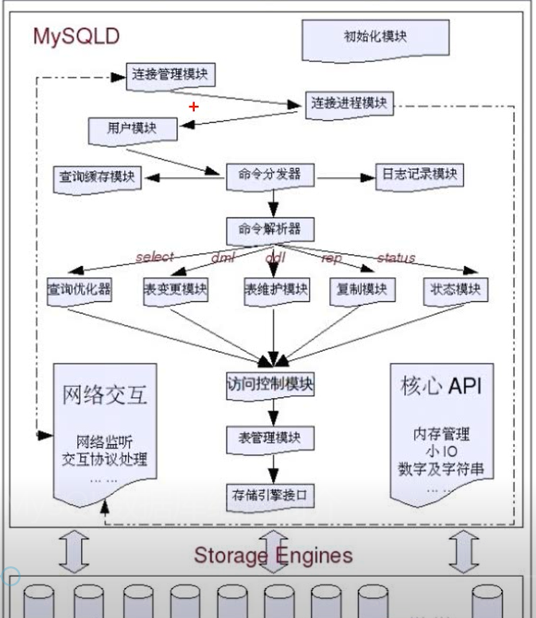
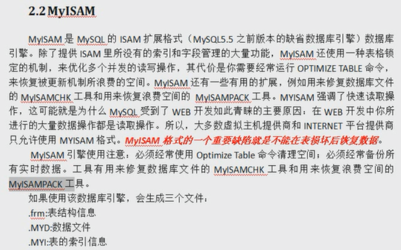
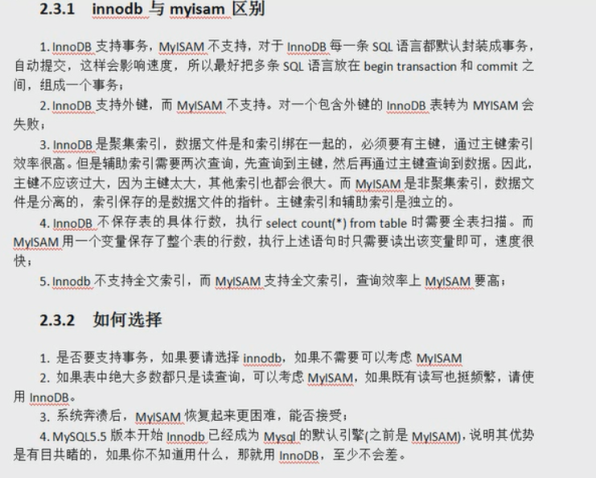

## sql优化

###存储引擎

+ mysqld   mysql  数据库管理系统 结构

#### 存储引擎(是建立在表上的)

+ ISAM

  + 进行读取的时候速度是比较快的 但是有两个致命的不足就是不支持事务 也不能容错
  + 加入你的数据库崩溃了你的数据就不能恢复了 所以说如果在使用ISAM存储引擎的话
  + 一定要常备份数据  里用它的复制特性 但是现在用的是比较少的了

+ MyISAM

  + 
  + 在插入数据的时候要维护数据和索引列的信息 所以说索引列越多 增删改速度就越慢
  + 降低增删改的操作速度
  + 支持全文索引

+ InnerDB

  + 是mysql 5.5 以及以上的默认存储引擎
  + 稍微降低了一些查询的速度 稍逊于ISAM 和MyISAM 查询速度降低了是因为支持了事务
  + 不支持全文索引 
  + 特点
    + 支持事务
    + 支持外键
    + 数据库多版本读取
    + 锁定机制的改进
  + 5.7 的数据文件后缀名是 .idb,.frm

+ InnerDB 和  MyISam 区别

  

  + 一般来说如果读取操作很多的话就使用myIsam引擎
  + 需要事务支持就使用InnerDB

+ Memory 

  + 数据是存储在内存中的
  + 一般用的比较少
  + 如果你的主机崩溃了 那么就只会剩下表结构了

+ BLOCKHOLE 存储引擎
  + 是一个非常有意思的存储引擎 不管我们写入任何信息 都读取不回来 有去无回
+ CSV 存储引擎
  + 操作的其实就是一个CSV文件 它不支持索引  主要用途就是有时候可能会需要通过数据库中的数据
  + 导出一份报表文件  而CSV是很多软件都支持的一种格式 所以我们可以先在数据表中建立一张CSV表
  + 然后将生成的报表信息插入到该表  即可得到一份CSV报表文件了

#### 存储引擎管理命令

**查看数据库支持的存储引擎**

show engines;

**查看当前表所使用的存储引擎**

show create table tablename

**修改表的存储引擎**

alter table tableName engine = engineName

### 索引

+ 创建索引
  + CREATE INDEX CLOUMN_NAME ON TABLENAME(CLOUMN_NAME)      普通索引
  + CREATE UNIQUE INDEX COLUMN_NAME ON TABLENAME(CLOUMN_NAME)      唯一索引  不允许重复值
+ 查看索引
  + SHOW INDEX FROM TABLENAME
  + SHOW KEYS FROM TABLENAME
+ 删除索引
  + DROP INDEX indexName ON tableName
+ 索引的 优点  
  - 通过创建唯一索引 可以保证数据库中的数据唯一性 
  - 可以大大加快查询速度 这也是创建索引的最大原因
  - 可以加速表与表之间的链接  
  - 通过使用索引 可以在查询过程中使用查询优化器 提高系统的性能
  - 再使用分组和排序的时候可以减少查询中分组和排序的时间
+ 索引的缺点
  - 创建索引 和维护索引需要耗时 这种时间随着数据量的增加而增加
  - 创建索引是占用物理空间的
  - 创建索引会降低增删改的速度 因为索引需要动态维护
  - 当我们的数据量范围越大索引的检索范围就更大 速度就越慢 
+ 什么样的字段适合创建索引
  - 经常需要查询的列
  - 需要和外表进行连接的列 就是外键
  - 需要排序的列 
  - 在需要进行范围查询的列上创建索引
  - 在经常使用where子句进行判断的列上创建索引 加快判断速度 
+ 什么样的字段不适合创建索引
  - 查询很少用到的
  - 那些定义为text,Blob的
  - 修改比较频繁的
+ 索引种类
  - B-TREE
  - FULL-TEXT 
    - 全文索引 是为了解决like低效的问题  也叫最左前缀
    - 只有这样使用才会使用索引 like  'xxx%'
  - 普通索引 和 唯一索引
    - 普通索引比较常见
    - 唯一索引呢就是值不能重复
+ 索引优化
  + 尽量使用短索引
  + 不要让字段的值为NULL
  + LIKE语句操作 要使用 like "xxx%" 才会使用索引 如果使用 like “%xxx%” 则不会使用索引
  + 不要在列上进行运算 会导致索引失效
+ sql 优化策略
  + 尽量不要使用全表扫描 首先考虑在 where 和 order by 涉及的列上建立索引
  +  避免判断NULL值  可能会造成全表扫描 不适用索引
  + 避免不等值判断
  + 避免使用or逻辑  会放弃使用索引 进行全表扫描   可以使用  union all 子句  
    + 例如  SELECT name FROM student WHERE name = "liwenxiang" OR age = 18  改为
    + SELECT name FROM student WHERE name = "李文祥" UNION ALL SELECT name FROM student WHERE age  = 18 ;  
  + 慎用 in 和 not in 逻辑  有可能会导致全表扫描  不走索引 
  + 组合索引的使用 在条件里需要加上开头的索引  第一个条件 
  + 查询字段  不要使用*  尽量用字段代替  不要返回无用的字段列