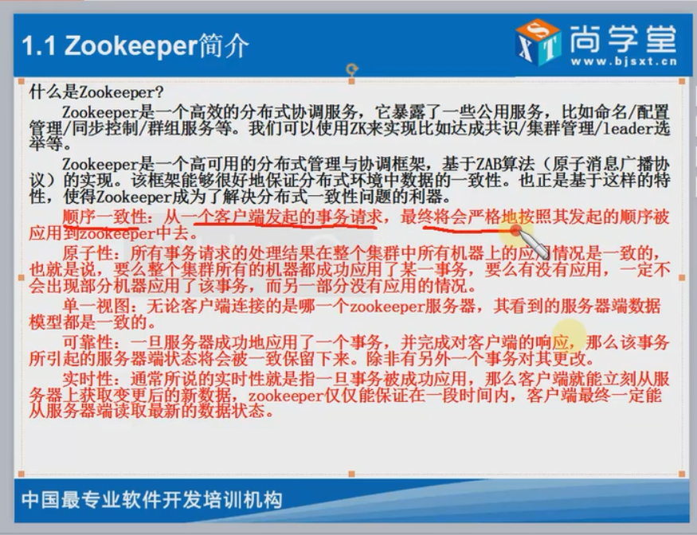
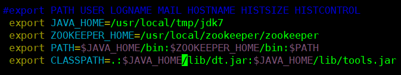
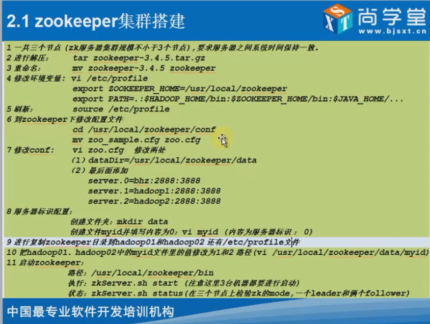
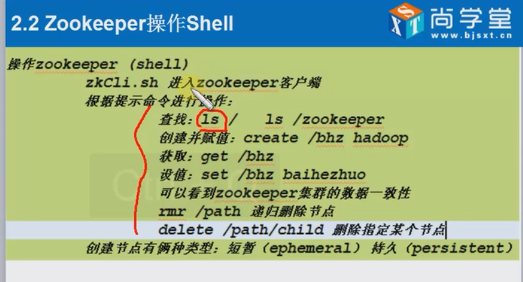
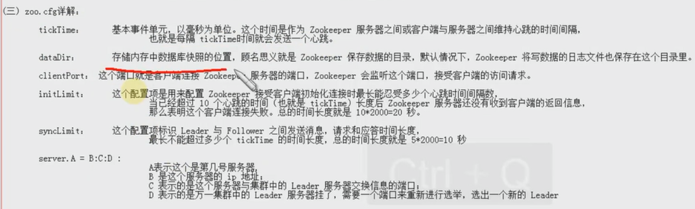
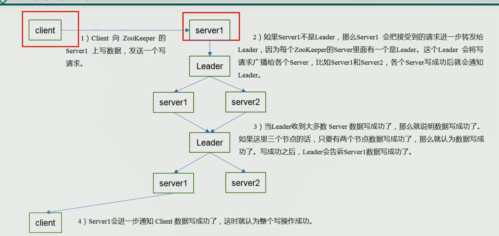

## Zookeeper 笔记

####简介

+ 是一个搞笑的分布式协调服务 他暴露了一些公用服务 比如命名/配置管理/同步控制/群组服务
+ 我们可以使用ZK来实现比如达成共识/集群管理/leader选举等.....
+ Zookeeper是一个高可用的分布式管理与协调框架 基于ZAB(原子消息广播协议)的实现算法paxos
+ 可以很好的保证数据的一致性
  + 顺序一致性
  + 原子性
  + 单一视图
  + 可靠性
  + 实时性
+ 不适合存储大量的数据   
+ 推荐奇数节点 偶数的话不利于算法计算



#### 组成

+ ZK server 根据其身份特性分为三种 leader follower Observer
+ Leader 负责客户端write类型请求
+ Follower 负责客户端的reader请求 参与leader的选举
+ Observer 特殊的Follower 其可以接受客户端reader请求 但不参与选举 扩展系统支撑能力 提高了读取速度 因为他不接受任何同步的写入请求 只负责与leader同步数据

#### 应用场景

+ 配置管理
+ 集群管理
+ 发布与订阅
+ 数据库切换
+ 分布式日志信息的收集
+ 分布式锁 队列管理等等......
+ 统一集群管理
+ 统一命名管理
+ 软负载均衡

#### 配置

+ 先上传zookeeper压缩包
+ 解压 
+ 配置环境变量



+ 刷新生效   source /etc/profile
+ 修改配置文件
  + zookeeper/conf文件夹下的zoo_sample.cfg
  + 我们可以修改一下名称  mv zoo_sample.cfg  zoo.cfg



+ 进入到配置文件中 修改 dataDir 值为你的数据存储目录 例如  dataDir = /usr/local/zookeeper/zookeeper/data
+ 需要在每一个节点(服务器)中的配置文件底部配置
  + server.0 = 主机IP:2888:3888
  + server.1 = 主机IP:2888:3888
+ 然后创建data目录 并且在下面创建myid文件写入每一个的节点名 
  + 例如 :    0
  + 例如 :    1
  + 例如 :    2
+ 节点名就是server.0 的0 可以随意起



### 结构

+ 其结构就是一个树状形式
+ 可以在里面的文件进行存储一些配置或者数据等等以及图片 json
+ 上图就包含了zookeeper的一些常用的客户端脚本命令 包含创建 获取 设置 删除  递归删除 查看
+ 打印出的信息有时间 版本 内容等.......
+ 不适合存储数据量大的
+ **配置文件信息**



#### Java 操作 Zookeeper (ZkClient)

+ 原生的zookeeper不好用

+ ZkClient相对于原生的好用一点 但还是不太好用

+ 最后有一个curator框架有点好用

  **原生操作(Zookeeper)**

  + 不能够递归创建节点

#### 分布式锁

+ zookeeper 是基于临时节点创建的  数据时存储到内存中的  性能比较高
+ 一个会话 或者请求走到zookeeper中的时候其先回去get节点如果获取不到的话就会去创建节点 会生成一个id标识 如果这个时候第二个请求来了 发现节点已经创建了那么就不会创建了 会等待这个临时节点删除掉之后再进行操作创建 不存在同时创建两个节点的问题 如果是这样的话分布式锁就没意义了  如果有网络延迟的话 两个都get不到 延迟过后 发现节点已经有一个存在了 那么就会抛出异常

#### ZKClient

+ 解决了递归创建节点	

### 面试重点  选举 -- 监听器

**选举**

+ 假设有五台服务器 在第一次运行的时候 每一台服务器都会给自己投一票 然后会给比自己大的iD号进行投票
+ 当某一台的票数大于等于机器的总数的一般的售后 立即升级为leader

#### 节点类型

+ 持久性
  + 客户机与服务端断开连接后 节点不删除
+ 短暂性
  + 客户机与服务端断开连接后 节点被删除
+ 临时节点下面不能有子节点

### 监听器

+ 常见监听
  + 监听节点数据的变化
  + 监听节点子节点的增减变化
+ 监听器原理
  + 

### 写数据流程




+ 当客户端发送过来一个请求的时候 服务端1接收到请求到那时这个服务器如果不是leader的哈这个服务器就会通知leader然后leader将这个请求发送给其他服务器进行写操作 等待写操作完毕之后leader就会通知服务端1写成功了 然后服务端1再通知client就代表整个写操作就完成了 【半数以上写操作成功就代表成功了】

### Zookeeper官方API操作

+ 创建子节点

  + create(znodeName,znodeDate.getBytes(),ACL（ZooDefs.Ids.OPEN_ACL_UNSAFE
  + ）,CreateMode)   节点名称  节点数据  节点访问权限 OPEN 常用 表示是开放的  节点类型 持久还是临时  是否在序列号

+ 获取子节点名称并且监听增删改

  ```java
  @Test
  public void getNodeChildren() throws KeeperException, InterruptedException {
      List<String> children = zkCli.getChildren("/", true); //第二个参数是表示是否监听
      for (String child : children) {
          System.out.println(child);
      }
      /**
       * 不让改线程终止  等待监听
       */
      Thread.sleep(Long.MAX_VALUE);
  }
  ```

```java
public void setZookeeper()throws IOException, KeeperException, InterruptedException{
    String connectionString = "192.168.190.132:2181,192.168.190.133:2181,192.168.190.134:2181";
    Integer sessionTimeOut = 5000;
    zkCli = new ZooKeeper(connectionString, sessionTimeOut, new Watcher() {
        public void process(WatchedEvent watchedEvent) {
            List<String> children = null;
            try {
                System.out.println("----------start----------");
                children = zkCli.getChildren("/", true);
                for (String child : children) {
                    System.out.println(child);
                }
                System.out.println("----------end----------");
            } catch (KeeperException e) {
                e.printStackTrace();
            } catch (InterruptedException e) {
                e.printStackTrace();
            }

        }
    });
}
```

+ 判断节点是否存在
  + 调用exixts方法  返回null的话就是不存在 否则就是存在
+ 获取数据
  + getData()
+ 删除节点
  + delete()

### 安全认证

+ 不常用
+ 在自一次链接zookeeper的时候加一个认证
  + 常用认证digest 密码是自己设定的
  + addAuthInfo
+ 就是在创建节点的时候需要指定一个认证的方式去创建

### curator 增删改查节点API

```java
/**
 * 重试策略
 */
RetryPolicy retryPolicy = new ExponentialBackoffRetry(1000,10);
CuratorFramework curatorFramework = CuratorFrameworkFactory.builder()
        .connectString(connectionString)
        .connectionTimeoutMs(sessionTimeOut)
        .retryPolicy(retryPolicy).build();
curatorFramework.start();

// 创建一个节点
String parentName = curatorFramework.create().forPath("/master", "init".getBytes());
// 创建master节点的子节点
String parentChildName = curatorFramework.create().forPath("/master/lock","child".getBytes());
//递归创建节点  永久节点
curatorFramework.create().creatingParentsIfNeeded().forPath("/parent/child","内容".getBytes());
//创建临时节点
curatorFramework.create().withMode(CreateMode.EPHEMERAL).forPath("/temp");
//递归删除节点
Void aVoid = curatorFramework.delete().deletingChildrenIfNeeded().forPath("/parent");
System.out.println(aVoid);
//删除节点
curatorFramework.delete().forPath("/master");
//获取子节点
List<String> strings = curatorFramework.getChildren().forPath("/");
for (String string : strings) {
    System.out.println(string);
}
//设置节点数据
curatorFramework.setData().forPath("/master","set 之后的值".getBytes());
//获取节点数据
byte[] bytes = curatorFramework.getData().forPath("/master");
System.out.println(new java.lang.String(bytes));
```

### 监听器

```java
/**
 * 增删改操作监听  第一种  只监听一次
 */
   /**
     * 观察者
     */
cf.getData().usingWatcher(new Watcher() {
    public void process(WatchedEvent watchedEvent) {
        System.out.println("监听到了 只不过只监听一次");
        System.out.println(watchedEvent.getType());
    }
}).forPath("/bhz");

Thread.sleep(Long.MAX_VALUE);

 /** 
     *  
     * @描述：第三种监听器的添加方式: Cache 的三种实现 实践 
     *   Path Cache：监视一个路径下1）孩子结点的创建、2）删除，3）以及结点数据的更新。 
     *                  产生的事件会传递给注册的PathChildrenCacheListener。 
     *  Node Cache：监视一个结点的创建、更新、删除，并将结点的数据缓存在本地。 
     *  Tree Cache：Path Cache和Node Cache的“合体”，监视路径下的创建、更新、删除事件，并缓存路径下所有孩子结点的数据。 
     */  
RetryPolicy rp = new ExponentialBackoffRetry(1000,10);
CuratorFramework cf = CuratorFrameworkFactory.builder().connectString(connectionString).connectionTimeoutMs(connectionTiemOut)
    .retryPolicy(rp).build();
cf.start();
final NodeCache cache = new NodeCache(cf,"/bhz",false);
cache.getListenable().addListener(new NodeCacheListener() {
    public void nodeChanged() throws Exception {
        System.out.println("the test node is change and result is :");
        System.out.println("path : "+cache.getCurrentData().getPath());
        System.out.println("data : "+new String(cache.getCurrentData().getData()));
        System.out.println("stat : "+cache.getCurrentData().getStat());
    }
});
cache.start();
Thread.sleep(Integer.MAX_VALUE);

/**
  监听子节点 实现分布式锁  定时任务   	
*/
public class curator_test5 {

    private static final String connectionString = "192.168.190.132:2181,192.168.190.133:2181,192.168.190.134:2181";
    private static final Integer connectionTimeOut = 5000;
    private static final Integer baseSleepTimeMs = 1000;
    private static final Integer maxRetries = 10;

    public static void main(String[] args) throws Exception {
        RetryPolicy rp = new ExponentialBackoffRetry(baseSleepTimeMs,maxRetries);
        CuratorFramework cf = CuratorFrameworkFactory
            .builder()
            .connectString(connectionString)
            .connectionTimeoutMs(connectionTimeOut)
            .retryPolicy(rp)
            .build();
        cf.start();
        final PathChildrenCache pathChildrenCache = new PathChildrenCache(cf,"/bhz",true);
        pathChildrenCache.start();
        pathChildrenCache.getListenable().addListener(new PathChildrenCacheListener() {
            public void childEvent(CuratorFramework curatorFramework, PathChildrenCacheEvent pathChildrenCacheEvent) throws Exception {
                String path = pathChildrenCacheEvent.getData().getPath();
                switch (pathChildrenCacheEvent.getType()){
                    case CHILD_ADDED:
                        if (path.equalsIgnoreCase("/bhz/bj"))
                            System.out.println("导入北京数据库");
                        else if (path.equalsIgnoreCase("/bhz/sh"))
                            System.out.println("导入上海数据库");
                        else if (path.equalsIgnoreCase("/bhz/nj"))
                            System.out.println("导入南京数据库");
                        break;
                    case CHILD_UPDATED:
                        break;
                    case CHILD_REMOVED:
                        break;
                }
            }
        });
        cf.create().withMode(CreateMode.EPHEMERAL).forPath("/bhz/bj");
        cf.create().withMode(CreateMode.EPHEMERAL).forPath("/bhz/sh");
        cf.create().withMode(CreateMode.EPHEMERAL).forPath("/bhz/nj");
        Thread.sleep(Long.MAX_VALUE);
    }
}

```